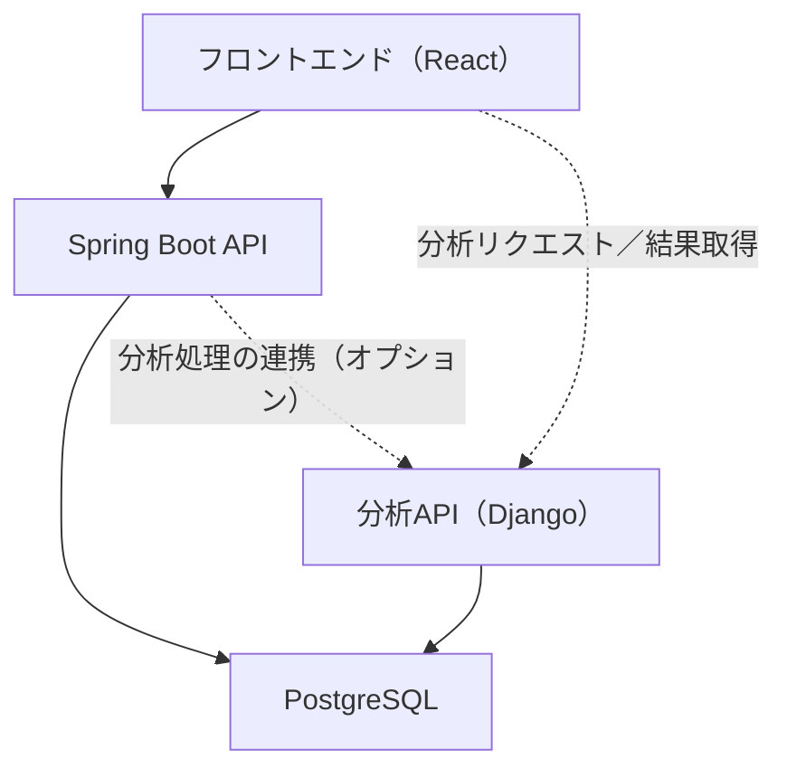

# 01_Project_Overview

# 「**大事**なペットをもっと**大切**に。」

---

# **プロジェクト概要**

大ペット（ダイペット）は、ペットの健康情報および病院予約を統合管理するWebプラットフォームである。

ユーザーが健康記録・通院履歴・ワクチン接種状況を継続的に管理できる環境を提供し、長期的な健康管理を支援することを目的とする。

---

# **開発目的**

- ペット健康管理効率化
- 病院予約利便性向上
- 継続的健康管理支援
- 実運用を想定したWebシステム設計経験獲得

---

# **想定ユーザー**

| **区分** | **説明** |
| --- | --- |
| USER | 一般利用者 |
| HOSPITAL_ADMIN | 病院管理者 |
| SYSTEM_ADMIN | システム管理者 |

---

# **使用技術**

| **区分** | **技術** |
| --- | --- |
| Frontend | React / TypeScript / Vite / Tailwind CSS |
| Backend | Java 17 / Spring Boot 3 |
| Analysis | Python / Django REST Framework |
| Database | PostgreSQL |
| Infrastructure | Docker Compose |
| Authentication | Spring Security / JWT |
| Migration | Flyway |

---

# **システム構成概要**

---

# **開発方針**

本プロジェクトでは、単純なCRUD開発ではなく、以下観点を重視して開発を行う。

- 要件定義
- 状態管理設計
- API設計
- Roleベース権限制御
- 保守性
- 拡張性
- 障害対応
- テスト戦略

---