# 03_Business_Flow

# **業務フロー設計書**

## **ドキュメント情報**

| **項目** | **内容** |
| --- | --- |
| Project | 大ペット（だいペット） |
| Document | Business Flow |
| Author | Koh Hanyeong |
| Status | Draft |
| Updated | 2026-08-23 |

# **1. 業務フロー概要**

本ドキュメントでは、「大ペット」における主要業務フローを定義する。

本システムでは、一般ユーザー、病院管理者、システム管理者の利用を想定し、認証、ペット管理、健康記録、病院予約、通知などの業務処理を整理する。

また、各業務フローに対して以下項目を定義する。

- 業務概要
- 入力項目
- 状態管理
- 異常系
- 業務フロー図
- 業務上考慮事項

---

# **2. 業務フロー一覧**

| **Flow ID** | **業務名** | **Actor** |
| --- | --- | --- |
| BF-001 | 会員登録フロー | USER |
| BF-002 | ログインフロー | ALL |
| BF-003 | ペット登録フロー | USER |
| BF-004 | ペット情報更新フロー | USER |
| BF-005 | 健康記録登録フロー | USER |
| BF-006 | 健康記録分析フロー | USER |
| BF-007 | 病院検索フロー | USER |
| BF-008 | 病院予約申請フロー | USER |
| BF-009 | 予約キャンセルフロー | USER |
| BF-010 | 予約承認・却下フロー | HOSPITAL_ADMIN |
| BF-011 | 診療完了処理フロー | HOSPITAL_ADMIN |
| BF-012 | ワクチン通知フロー | SYSTEM |
| BF-013 | 通知確認フロー | USER |
| BF-014 | 病院管理フロー | SYSTEM_ADMIN |
| BF-015 | ユーザー管理フロー | SYSTEM_ADMIN |

---

# **3. BF-001 会員登録フロー**

## **概要**

ユーザーが新規会員登録を行う。

---

## **登録項目**

| **項目** | **必須** | **条件** |
| --- | --- | --- |
| Email | ○ | unique / メール形式 |
| Password | ○ | 8文字以上 |
| Nickname | ○ | 最大20文字 |

---

## **状態**

| **状態** | **説明** |
| --- | --- |
| ACTIVE | 利用可能状態 |
| SUSPENDED | 停止状態 |

---

## **異常系**

| **条件** | **処理** |
| --- | --- |
| 重複メール | エラー返却 |
| 入力不正 | バリデーションエラー |

---

## **業務フロー**

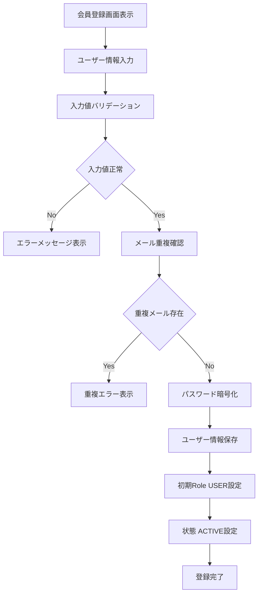

---

# **4. BF-002 ログインフロー**

## **概要**

ユーザー認証を行い、JWTを発行する。

---

## **入力項目**

| **項目** | **必須** |
| --- | --- |
| Email | ○ |
| Password | ○ |

---

## **発行情報**

| **項目** | **内容** |
| --- | --- |
| Access Token | API認証用 |
| Refresh Token | Token再発行用 |

---

## **異常系**

| **条件** | **処理** |
| --- | --- |
| 認証失敗 | ログイン失敗 |
| 停止アカウント | ログイン拒否 |

---

## **業務フロー**

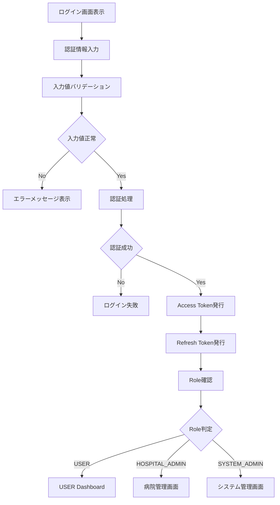

---

# **5. BF-003 ペット登録フロー**

## **概要**

ユーザーがペット情報を登録する。

---

## **登録項目**

| **項目** | **必須** |
| --- | --- |
| ペット名 | ○ |
| 種類 | ○ |
| 生年月日 | × |
| 性別 | × |
| 体重 | × |
| 画像 | × |

---

## **異常系**

| **条件** | **処理** |
| --- | --- |
| 未ログイン | 認証エラー |
| 入力不正 | バリデーションエラー |

---

## **業務フロー**

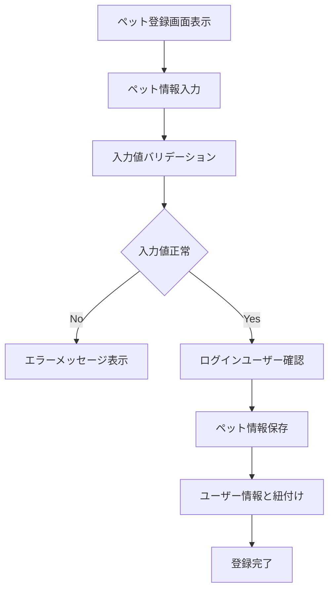

---

# **6. BF-004 ペット情報更新フロー**

## **概要**

ユーザーが登録済ペット情報を更新・削除する。

---

## **更新項目**

| **項目** | **必須** |
| --- | --- |
| ペット名 | ○ |
| 種類 | ○ |
| 生年月日 | × |
| 性別 | × |
| 体重 | × |

---

## **異常系**

| **条件** | **処理** |
| --- | --- |
| 他ユーザーのペット | 権限エラー（PET-002） |
| 存在しないペット | PET-001 |
| 入力不正 | バリデーションエラー |

---

## **業務フロー**

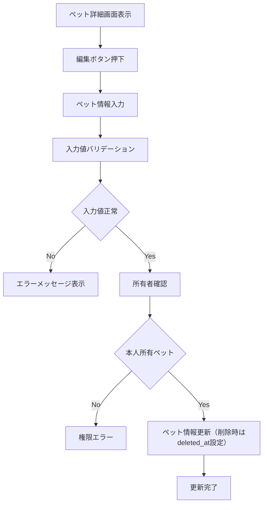

---

# **7. BF-005 健康記録登録フロー**

## **概要**

ユーザーが健康記録を登録する。

---

## **登録項目**

| **項目** | **必須** |
| --- | --- |
| 体重 | × |
| 症状 | × |
| メモ | × |

---

## **分析対象**

| **項目** | **用途** |
| --- | --- |
| 体重 | 推移分析 |
| 症状 | 傾向分析 |

---

## **異常系**

| **条件** | **処理** |
| --- | --- |
| 他ユーザーのペット | 権限エラー |
| 入力不正 | バリデーションエラー |

---

## **業務フロー**

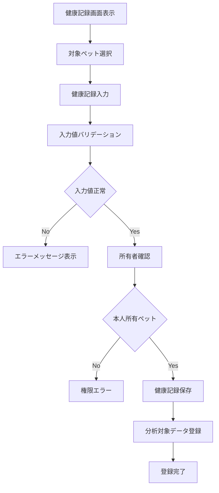

---

# **8. BF-006 健康記録分析フロー**

## **概要**

健康記録を分析し、統計情報を表示する。

---

## **分析内容**

| **項目** | **内容** |
| --- | --- |
| 体重推移 | グラフ表示 |
| 症状傾向 | 統計分析 |
| 記録履歴 | 時系列表示 |

---

## **業務フロー**

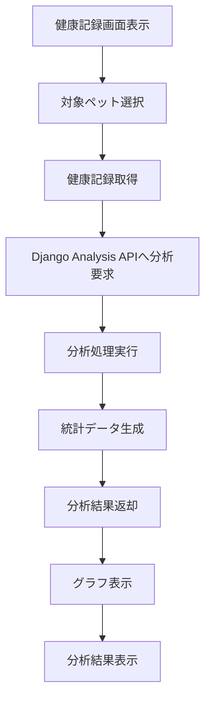

---

# **9. BF-007 病院検索フロー**

## **概要**

ユーザーが予約先の病院を検索・閲覧する。

---

## **検索条件**

| **条件** | **内容** |
| --- | --- |
| keyword | 病院名部分一致 |
| area | 住所（地域）部分一致 |

---

## **表示対象**

ACTIVE状態の病院のみ表示する（SUSPENDEDは一覧対象外 — `08_State_Design` §4-3）。

---

## **業務フロー**

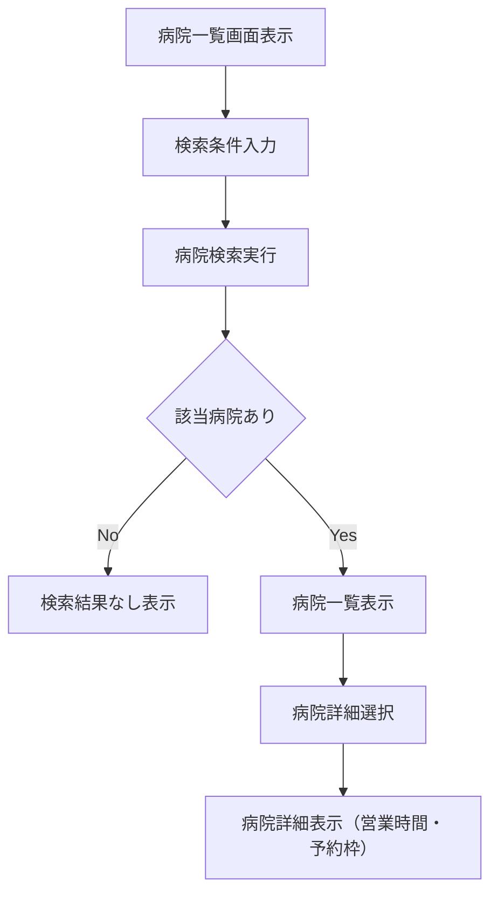

---

# **10. BF-008 病院予約申請フロー**

## **概要**

ユーザーが病院予約を申請する。

---

## **入力項目**

| **項目** | **必須** |
| --- | --- |
| 病院 | ○ |
| ペット | ○ |
| 予約日時 | ○ |
| メモ | × |

---

## **状態**

| **状態** | **説明** |
| --- | --- |
| REQUESTED | 予約申請中 |
| APPROVED | 承認済 |
| REJECTED | 却下 |
| COMPLETED | 診療完了 |
| CANCELLED | キャンセル |

---

## **異常系**

| **条件** | **処理** |
| --- | --- |
| 重複予約 | エラー返却 |
| 過去日時 | エラー返却 |
| 他ユーザーペット | 権限エラー |

---

## **業務フロー**

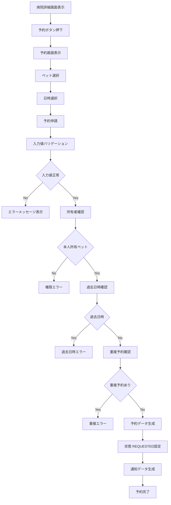

---

# **11. BF-009 予約キャンセルフロー**

## **概要**

予約をキャンセルする。

---

## **キャンセル可能状態**

| **状態** |
| --- |
| REQUESTED |
| APPROVED |

---

## **異常系**

| **条件** | **処理** |
| --- | --- |
| COMPLETED状態 | キャンセル不可 |
| 他ユーザー予約 | 権限エラー |

---

## **業務フロー**

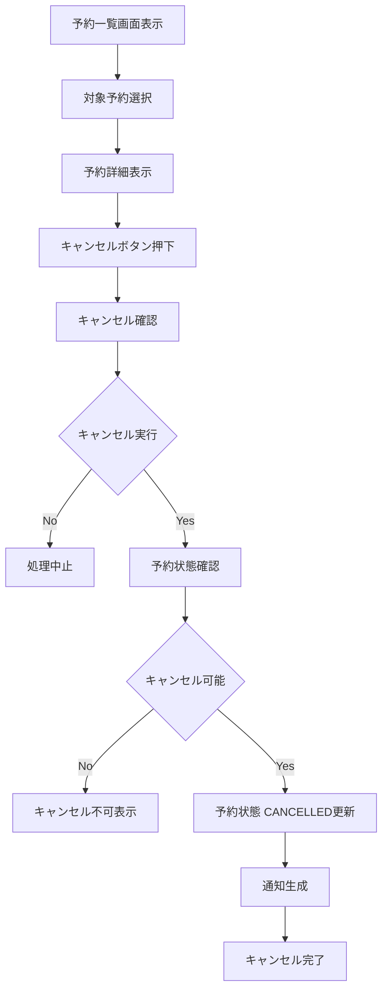

---

# **12. BF-010 予約承認・却下フロー**

## **概要**

病院管理者が予約を承認または却下する。

---

## **管理対象状態**

---

| **状態** |
| --- |
| REQUESTED |

---

## **異常系**

| **条件** | **処理** |
| --- | --- |
| REQUESTED以外 | 状態エラー |
| 他病院予約 | 権限エラー |

---

## **業務フロー**

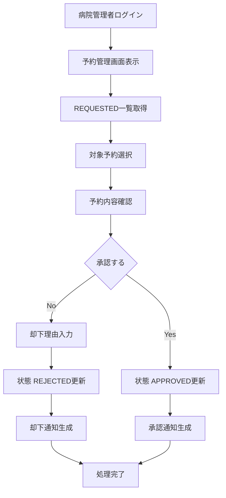

---

# **13. BF-011 診療完了処理フロー**

## **概要**

承認済予約を診療完了状態へ変更する。

---

## **完了可能状態**

| **状態** |
| --- |
| APPROVED |

---

## **異常系**

| **条件** | **処理** |
| --- | --- |
| APPROVED以外の状態 | 完了不可（RESERVATION-008） |
| 他病院予約 | 権限エラー |

---

## **業務フロー**

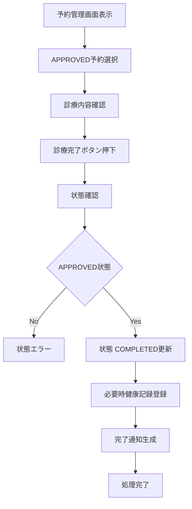

---

# **14. BF-012 ワクチン通知フロー**

## **概要**

ワクチン接種予定日を定期確認し、通知を生成する。

---

## **Scheduler実行情報**

| **項目** | **内容** |
| --- | --- |
| 実行時間 | 毎日 09:00 |
| 実行方式 | Spring Scheduler |
| 通知対象 | 接種7日前 |

---

## **通知種別**

| **通知** | **内容** |
| --- | --- |
| ワクチン通知 | 接種予定通知 |

---

## **異常系**

| **条件** | **処理** |
| --- | --- |
| 通知済み | 重複通知防止 |
| 対象データなし | 処理終了 |

---

## **業務フロー**

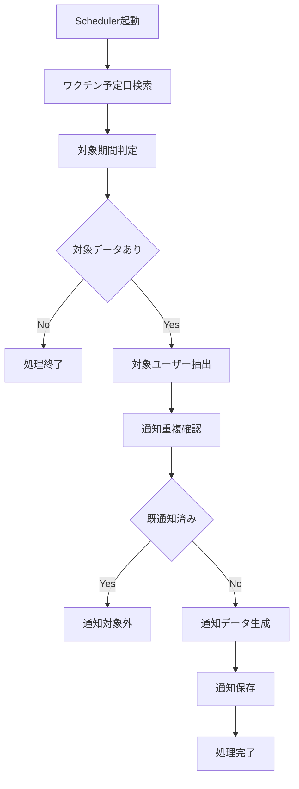

---

# **15. BF-013 通知確認フロー**

## **概要**

ユーザーが通知内容を確認する。

---

## **通知種類**

| 通知 |
| --- |
| 予約承認 |
| 予約却下 |
| ワクチン通知 |
| 診療完了 |

---

## **業務フロー**

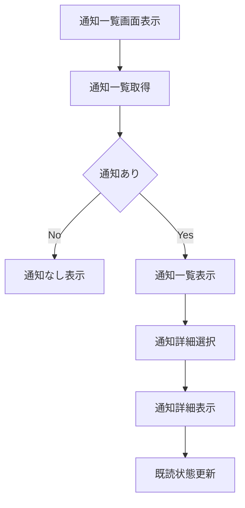

---

# **16. BF-014 病院管理フロー**

## **概要**

システム管理者が病院情報を管理する。

---

## **管理操作**

| 操作 |
| --- |
| 新規登録 |
| 更新 |
| 利用停止 |

---

## **異常系**

| **条件** | **処理** |
| --- | --- |
| 入力不正 | バリデーションエラー |
| 権限不足 | 認可エラー |

---

## **業務フロー**

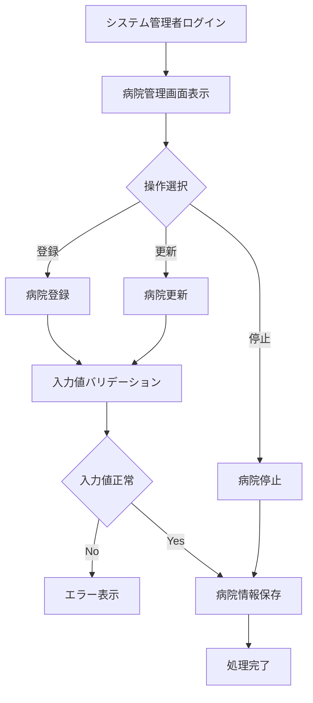

---

# **17. BF-015 ユーザー管理フロー**

## **概要**

システム管理者がユーザー状態を管理する。

---

## **管理可能状態**

| **状態** |
| --- |
| ACTIVE |
| SUSPENDED |

---

## **管理操作**

| **操作** |
| --- |
| アカウント停止 |
| Role変更 |

---

## **業務フロー**

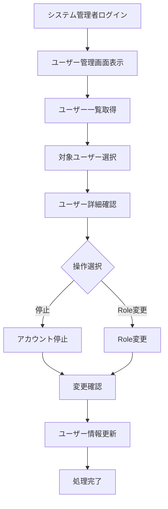

---

# **18. 予約状態遷移**

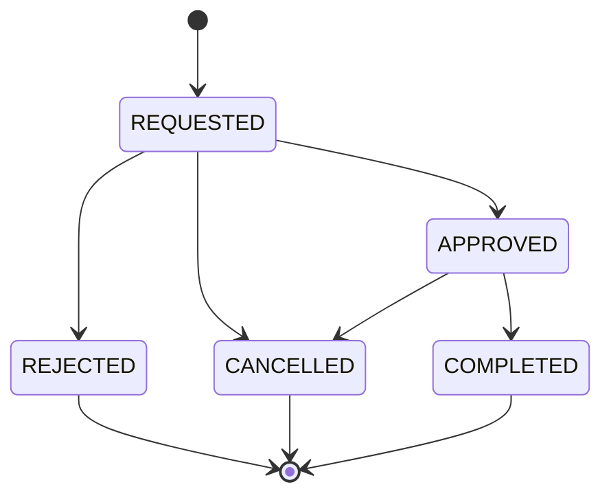

---

# **19. システム全体業務フロー**

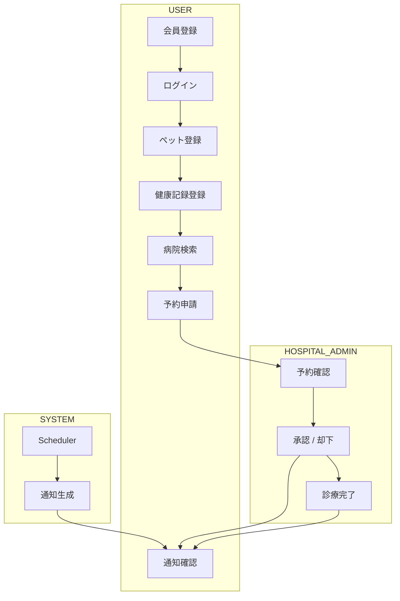