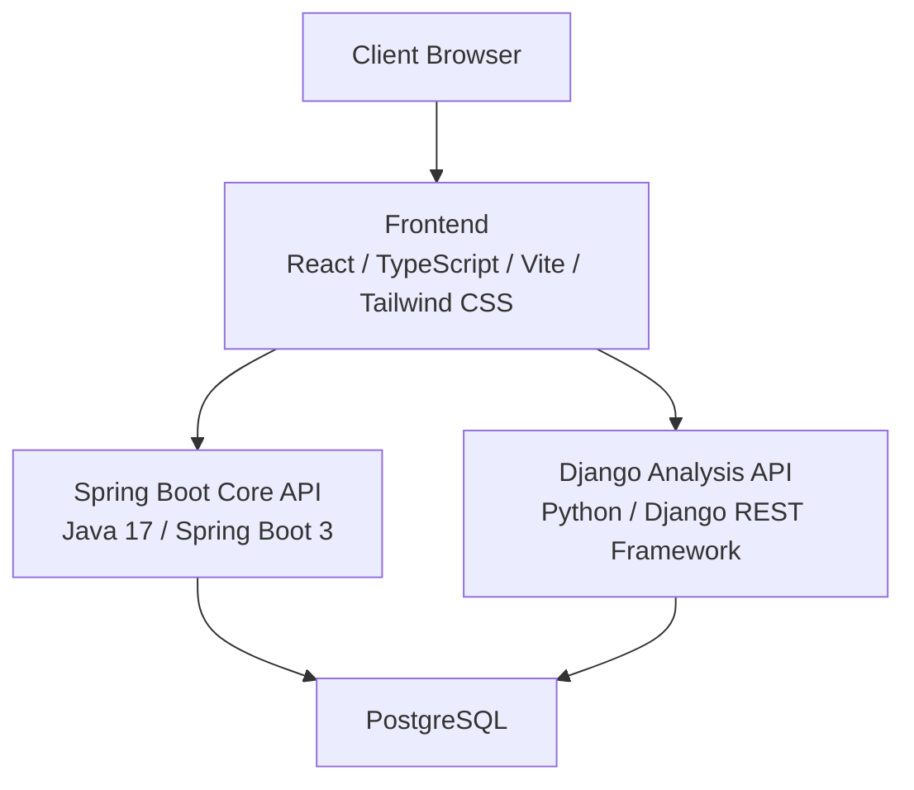
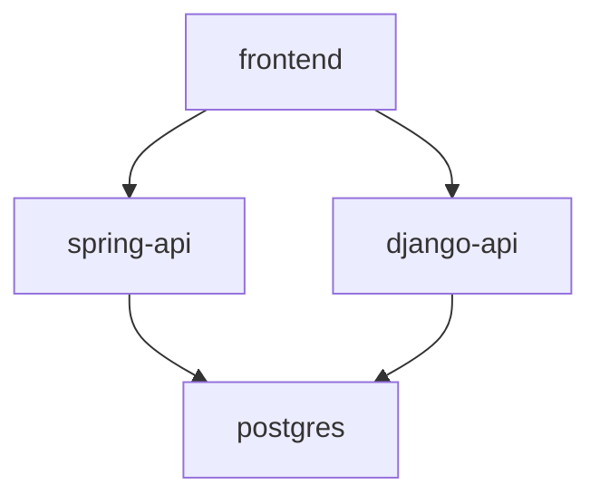
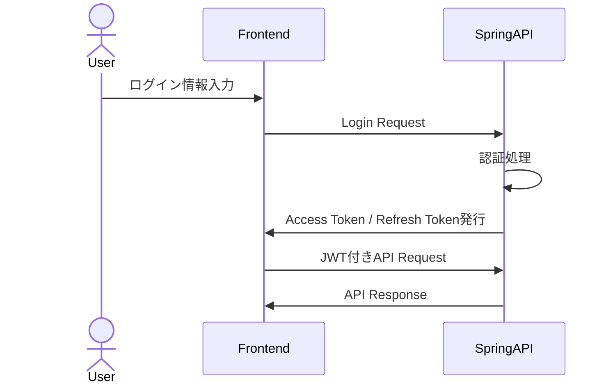
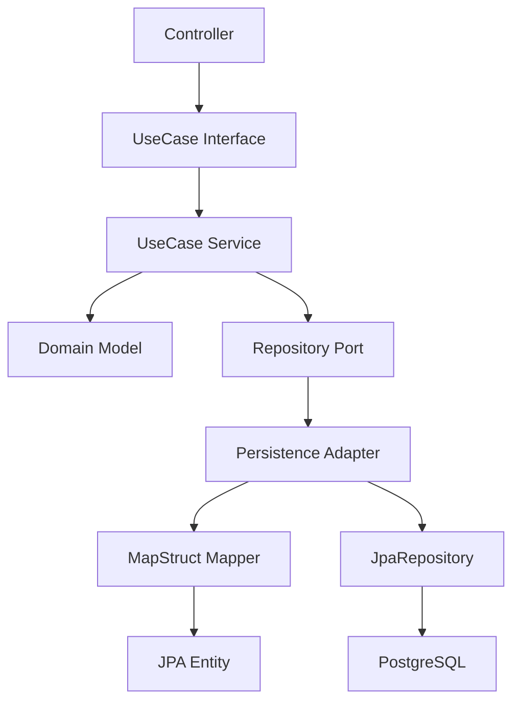
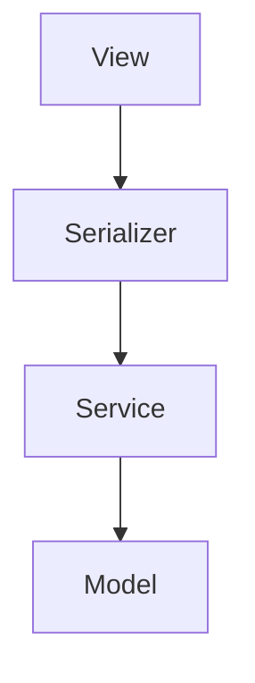
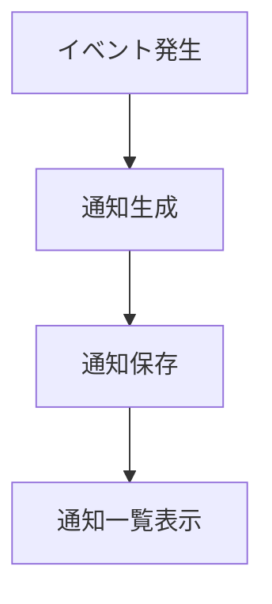
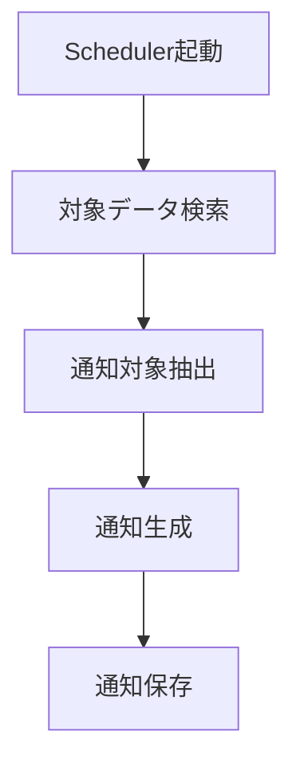
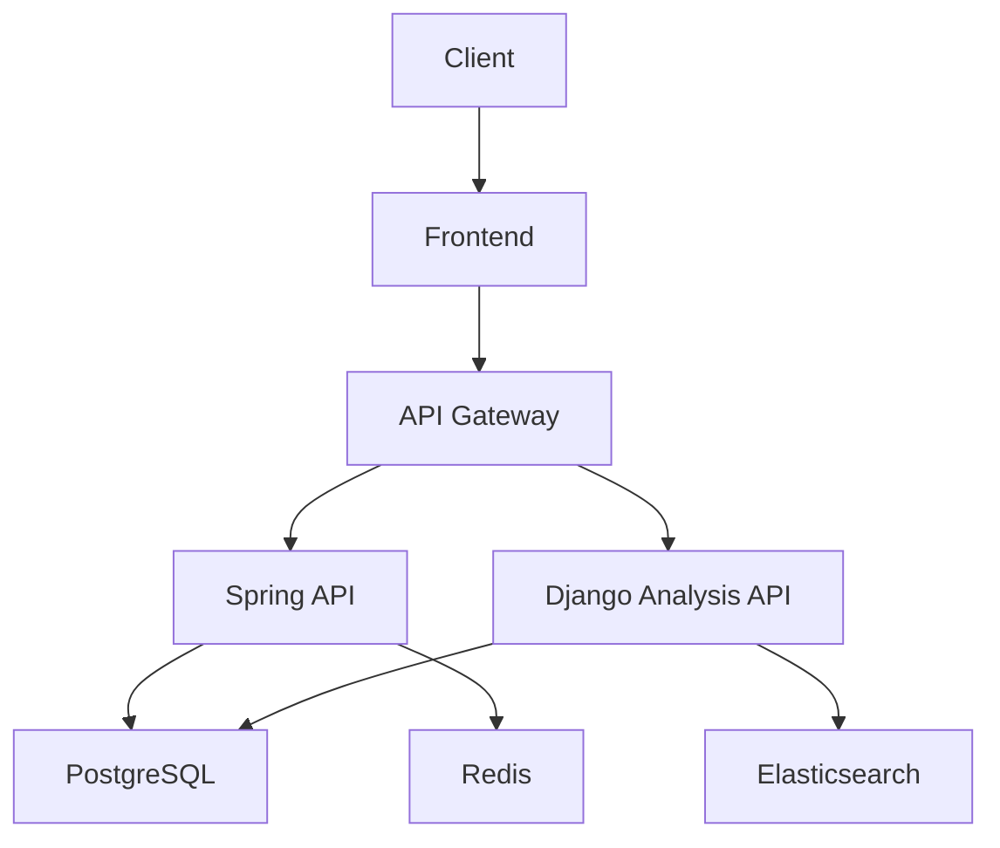

# 04_System_Architecture

# **システムアーキテクチャ設計書**

## **ドキュメント情報**

| **項目** | **内容** |
| --- | --- |
| Project | 大ペット（だいペット） |
| Document | System Architecture |
| Author | Koh Hanyeong |
| Status | Draft |
| Updated | 2026-08-02 |

---

# **1. アーキテクチャ概要**

「大ペット」は、Frontend、Core API、Analysis API、Databaseを分離した構成を採用する。

認証・予約・権限制御などのトランザクション整合性が重要な機能はSpring Bootで管理し、健康記録分析・統計・将来的なAI分析などのデータ処理系機能はDjango REST Frameworkで管理する。

これにより、以下を実現する。

- 責務分離
- 保守性向上
- 拡張性向上
- API独立性確保
- 分析機能追加容易化

---

# **2. システム全体構成**



---

# **3. システム構成要素**

| **区分** | **技術** | **主な責務** |
| --- | --- | --- |
| Frontend | React / TypeScript / Vite / Tailwind CSS | UI表示、入力制御、API通信 |
| Core API | Java 17 / Spring Boot 3 | 認証、予約、権限制御、業務ロジック |
| Analysis API | Python / Django REST Framework | 健康分析、統計処理 |
| Database | PostgreSQL | データ永続化 |
| Infrastructure | Docker Compose | ローカル環境構築 |
| Migration | Flyway | DBバージョン管理 |

---

# **4. Frontend構成**

## **使用技術**

| **項目** | **技術** |
| --- | --- |
| Framework | React |
| Language | TypeScript |
| Build Tool | Vite |
| UI | Tailwind CSS |

---

## **主な責務**

- ログイン画面
- Dashboard画面
- ペット管理画面
- 健康記録画面
- 病院予約画面
- 管理者画面
- 通知画面

---

## **Frontend構成方針**

- Componentベース設計
- API分離
- 状態管理分離
- Responsive対応
- 再利用可能UI設計

---

# **5. Backend構成**

# **5-1. Spring Boot Core API**

## **使用技術**

| **項目** | **技術** |
| --- | --- |
| Language | Java 17 |
| Framework | Spring Boot 3 |
| Security | Spring Security |
| ORM | JPA |
| Migration | Flyway |

---

## **主な責務**

- JWT認証
- Roleベース認可
- 会員管理
- ペット管理
- 病院予約
- 通知管理
- トランザクション管理

---

## **採用理由**

| **理由** | **内容** |
| --- | --- |
| 型安全性 | Javaによる安全な実装 |
| Security | Spring Security活用 |
| Transaction | トランザクション制御容易 |
| ORM | JPAによるDB管理 |

---

# **5-2. Django Analysis API**

## **使用技術**

| **項目** | **技術** |
| --- | --- |
| Language | Python |
| Framework | Django REST Framework |

---

## **主な責務**

- 健康記録分析
- 統計データ生成
- 体重推移分析
- 症状傾向分析
- 将来的AI分析

---

## **採用理由**

| **理由** | **内容** |
| --- | --- |
| 分析処理 | Pythonとの親和性 |
| 拡張性 | AI機能追加容易 |
| API分離 | Core API負荷分散 |

---

# **6. Database構成**

## **使用技術**

| **項目** | **技術** |
| --- | --- |
| RDBMS | PostgreSQL |

---

## **管理対象**

- ユーザー情報
- ペット情報
- 病院情報
- 予約情報
- 健康記録
- 通知情報

---

## **DB設計方針**

- 正規化を基本とする
- FK制約を利用
- 論理削除対応
- created_at / updated_at管理
- FlywayによるMigration管理

---

# **7. Docker Compose構成**

## **構成サービス**

| **Service** | **Port** |
| --- | --- |
| frontend | 5173 |
| spring-api | 8080 |
| django-api | 8000 |
| postgres | 5432 |

---

## **Docker Compose構成図**



---

## **採用理由**

- 開発環境統一
- ローカル構築簡略化
- Container単位管理
- Service分離

---

# **8. API通信構成**

## **通信方式**

| **通信元** | **通信先** | **方式** |
| --- | --- | --- |
| Frontend | Spring API | REST API / JSON |
| Frontend | Django API | REST API / JSON |
| Spring API | PostgreSQL | JDBC |
| Django API | PostgreSQL | ORM |

---

## **API Versioning**

```
/api/v1/
```

形式を採用する。

---

## **API例**

```
/api/v1/auth/login
/api/v1/pets
/api/v1/reservations
/api/v1/health-records
/api/v1/analysis/summary
```

---

# **9. 認証アーキテクチャ**

## **認証方式**

JWTベースStateless認証を採用する。

---

## **認証フロー**



---

## **Token情報**

| **Token** | **用途** |
| --- | --- |
| Access Token | API認証 |
| Refresh Token | Token再発行 |

---

# **10. 認可アーキテクチャ**

## **Role一覧**

| **Role** | **説明** |
| --- | --- |
| USER | 一般利用者 |
| HOSPITAL_ADMIN | 病院管理者 |
| SYSTEM_ADMIN | システム管理者 |

---

## **Role制御例**

| **API** | **USER** | **HOSPITAL_ADMIN** | **SYSTEM_ADMIN** |
| --- | --- | --- | --- |
| 予約申請 | ○ | × | ○ |
| 予約承認 | × | ○ | ○ |
| 病院管理 | × | × | ○ |

---

# **11. Spring Boot Layer構成**

## **Layer構成**

認証・予約などのトランザクション整合性が重要な業務ロジックに対し、Domain ModelとJPA Entityを分離したHexagonal-likeアーキテクチャを採用する。



---

## **各Layer責務**

| **Layer** | **責務** |
| --- | --- |
| Controller | HTTP Request / Response制御 |
| UseCase Interface | Application-levelビジネス契約 |
| UseCase Service | ビジネスフロー実装 |
| Domain Model | ビジネスルール・状態遷移・ドメインバリデーション |
| Repository Port | 永続化インターフェース（Domain層に属する） |
| Persistence Adapter | Repository Port実装（JPA利用） |
| MapStruct Mapper | Domain ↔ JPA Entity 変換 |
| JPA Entity | DBテーブルマッピング専用 |
| JpaRepository | Spring Data JPA DBアクセス |
| GlobalExceptionHandler | Exception → ApiResponse 変換 |

---

## **採用理由**

| **理由** | **内容** |
| --- | --- |
| Domain保護 | JPA依存をDomainに持ち込まない |
| テスト容易性 | UseCase単位でMock可能 |
| 状態遷移保護 | Domainが状態変更ルールを持つ |
| 責務明確化 | 各Layerの責務が単一 |

---

# **12. Django Layer構成**

## **Layer構成**



---

## **各Layer責務**

| **Layer** | **責務** |
| --- | --- |
| View | API Entry Point |
| Serializer | Validation / Data変換 |
| Service | 分析処理・統計ロジック |
| Model | DBテーブルマッピング（Django ORM） |

---

# **13. Notificationアーキテクチャ**

## **通知種類**

| **通知** | **内容** |
| --- | --- |
| 予約承認通知 | 承認時通知 |
| 予約却下通知 | 却下時通知 |
| ワクチン通知 | 接種予定通知 |
| 診療完了通知 | 完了通知 |

---

## **通知生成フロー**



---

# **14. Scheduler構成**

## **Scheduler一覧**

| **Scheduler** | **実行時間** |
| --- | --- |
| ワクチン通知 | 毎日 09:00 |
| 予約枠自動生成 | 例: 毎月1日 00:00（`hospital_business_hours`を元に翌月分の`hospital_schedules`を生成） |

---

## **Schedulerフロー**



---

# **15. ログ管理方針**

## **ログレベル**

| **Level** | **用途** |
| --- | --- |
| INFO | 通常処理 |
| WARN | 異常可能性 |
| ERROR | 例外発生 |

---

## **出力対象**

- 認証処理
- 予約処理
- Exception
- Scheduler
- API Error

---

# **16. 例外処理方針**

## **共通例外処理**

Spring BootではGlobal Exception Handlerを利用する。

---

## **Error Response形式**

```json
{
  "success": false,
  "code": "RESERVE-001",
  "message": "既に予約済みです。"
}
```

---

# **17. セキュリティ方針**

## **セキュリティ対策**

| **項目** | **内容** |
| --- | --- |
| Password | BCrypt暗号化 |
| Authentication | JWT |
| Authorization | Roleベース制御 |
| API保護 | 認証必須 |
| CORS | 許可Origin制御 |

---

# **18. アーキテクチャ上考慮事項**

## **責務分離**

認証・予約系と分析系を分離することで保守性を向上する。

---

## **拡張性**

将来的に以下を追加可能な構成とする。

- Redis
- Elasticsearch
- AI分析
- Push通知
- Kubernetes
- CI/CD

---

## **保守性**

- DTO分離
- Layer構成統一
- Migration管理
- API Versioning

---

# **19. 将来構成イメージ**



---