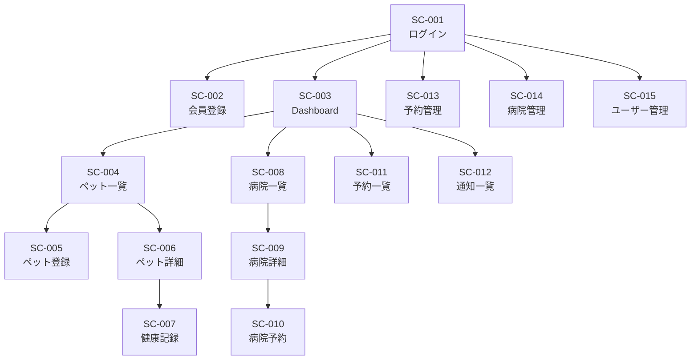
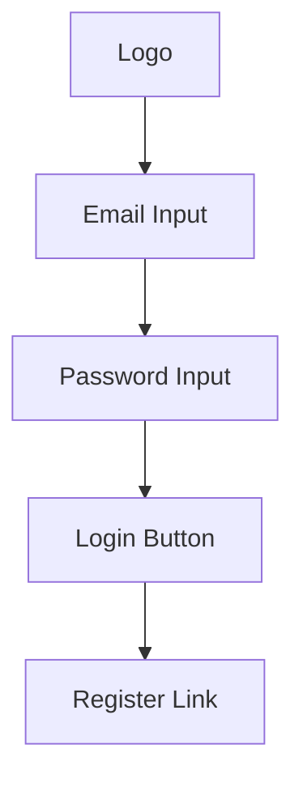
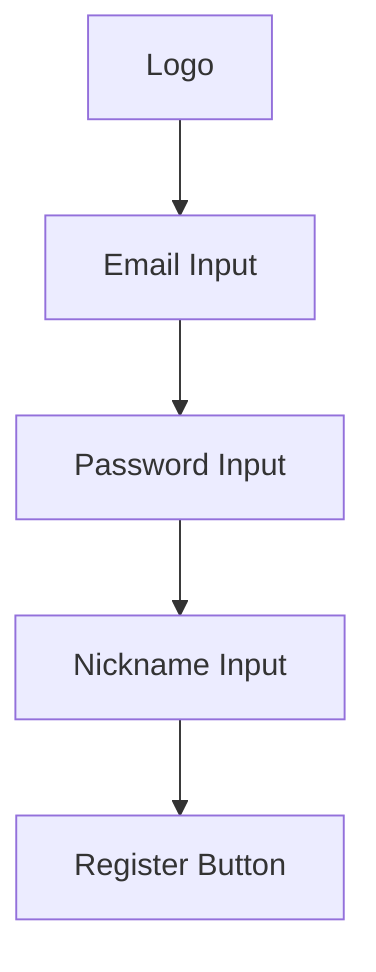
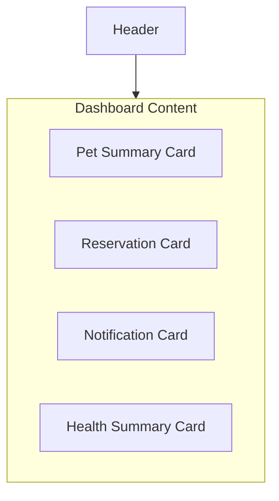
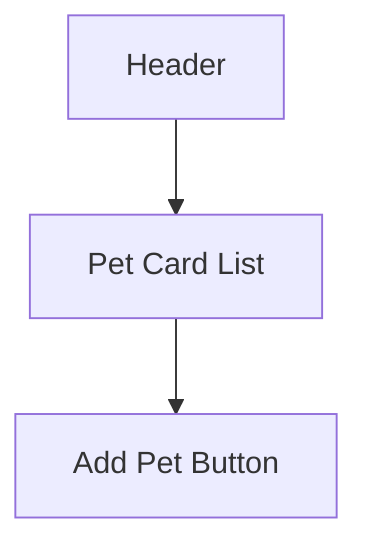
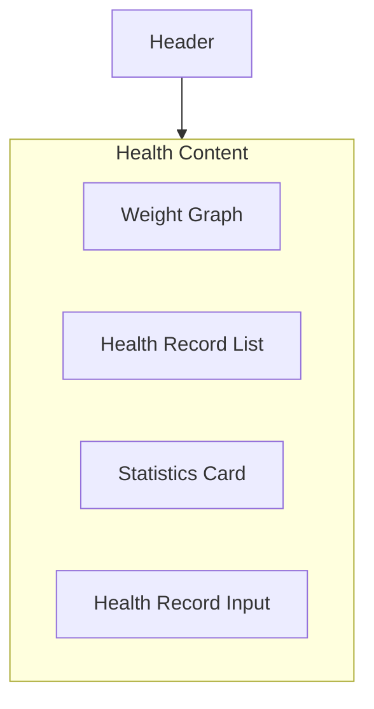
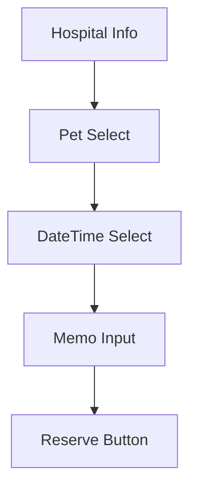
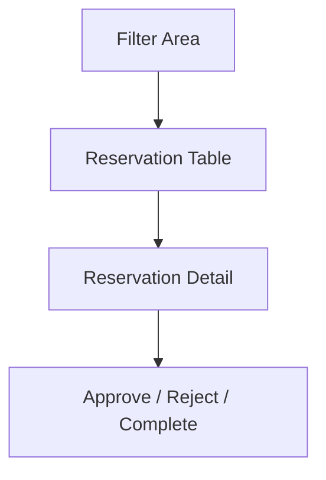

# 05_Screen_Design

# **画面設計書**

## **ドキュメント情報**

| **項目** | **内容** |
| --- | --- |
| Project | 大ペット（だいペット） |
| Document | Screen Design |
| Author | Koh Hanyeong |
| Status | Draft |
| Updated | 2026-05-17 |

# **1. 画面設計概要**

---

# **2. 画面一覧**

本ドキュメントでは、「大ペット」における主要画面構成および画面要件を定義する。

本システムでは、一般ユーザー・病院管理者・システム管理者それぞれの利用画面を提供し、ユーザー操作・入力項目・画面遷移・表示内容を整理する。

| Screen ID | 画面名 | 利用者 |
| --- | --- | --- |
| SC-001 | ログイン画面 | ALL |
| SC-002 | 会員登録画面 | ALL |
| SC-003 | Dashboard画面 | USER |
| SC-004 | ペット一覧画面 | USER |
| SC-005 | ペット登録画面 | USER |
| SC-006 | ペット詳細画面 | USER |
| SC-007 | 健康記録画面 | USER |
| SC-008 | 病院一覧画面 | USER |
| SC-009 | 病院詳細画面 | USER |
| SC-010 | 病院予約画面 | USER |
| SC-011 | 予約一覧画面 | USER |
| SC-012 | 通知一覧画面 | USER |
| SC-013 | 予約管理画面 | HOSPITAL_ADMIN |
| SC-014 | 病院管理画面 | SYSTEM_ADMIN |
| SC-015 | ユーザー管理画面 | SYSTEM_ADMIN |

---

# **3. 画面遷移概要**

---

# **4. 共通UI設計方針**

## **UI方針**

- シンプルかつ直感的なUI
- Mobile First設計
- CardベースUI
- 一貫したColor Rule適用
- 操作回数最小化

---

## **Responsive対応**

---

# **4. 共通UI設計方針**

## **UI方針**

- シンプルかつ直感的なUI
- Mobile First設計
- CardベースUI
- 一貫したColor Rule適用
- 操作回数最小化

---

## **Responsive対応**

| **Device** | **対応** |
| --- | --- |
| Mobile | 縦画面最適化 |
| Tablet | 2カラム |
| Desktop | Full Layout |

---

## **使用UI技術**

| **項目** | **技術** |
| --- | --- |
| Framework | React |
| Styling | Tailwind CSS |
| Icon | Lucide React想定 |
| Routing | React Router |

---

# **5. SC-001 ログイン画面**

## **目的**

登録済ユーザー認証を行う。

---

## **表示項目**

| **項目** | **内容** |
| --- | --- |
| Email Input | メールアドレス |
| Password Input | パスワード |
| Login Button | ログイン |
| Register Link | 会員登録画面遷移 |

---

## **入力バリデーション**

| **項目** | **条件** |
| --- | --- |
| Email | メール形式 |
| Password | 8文字以上 |

---

## **異常系**

| **条件** | **表示内容** |
| --- | --- |
| 認証失敗 | ログインに失敗しました |
| 停止アカウント | 利用停止中です |

---

## **UI構成**

---

# **6. SC-002 会員登録画面**

## **目的**

新規会員登録を行う。

---

## **入力項目**

| **項目** | **必須** |
| --- | --- |
| Email | ○ |
| Password | ○ |
| Nickname | ○ |

---

## **異常系**

| **条件** | **処理** |
| --- | --- |
| 重複メール | エラー表示 |
| 入力不正 | バリデーション表示 |

---

## **UI構成**

---

# **7. SC-003 Dashboard画面**

## **目的**

ユーザー主要情報を表示する。

---

## **表示内容**

- ペット情報
- 次回予約
- 通知
- 健康記録サマリー

---

## **Dashboard構成**

---

# **8. SC-004 ペット一覧画面**

## **目的**

登録済ペット一覧を表示する。

---

## **表示項目**

| **項目** | **内容** |
| --- | --- |
| ペット画像 | Thumbnail |
| ペット名 | Name |
| 種類 | Type |
| 年齢 | Age |
| 詳細ボタン | Detail |

---

## **操作**

| **操作** | **内容** |
| --- | --- |
| 追加 | ペット登録 |
| 編集 | 情報更新 |
| 削除 | 論理削除 |

---

## **UI構成**

---

# **9. SC-005 ペット登録画面**

## **目的**

新規ペット情報を登録する。

---

## **入力項目**

| **項目** | **必須** |
| --- | --- |
| ペット名 | ○ |
| 種類 | ○ |
| 生年月日 | × |
| 性別 | × |
| 体重 | × |
| 画像 | × |

---

## **バリデーション**

| **項目** | **条件** |
| --- | --- |
| ペット名 | 最大20文字 |
| 体重 | 数値のみ |

---

## **異常系**

| **条件** | **処理** |
| --- | --- |
| 未ログイン | 認証エラー |
| 入力不正 | バリデーションエラー |

---

# **10. SC-006 ペット詳細画面**

## **目的**

ペット詳細情報を表示する。

---

## **表示内容**

- ペット基本情報
- 最近の健康記録
- 次回予約
- ワクチン予定

---

## **操作**

| **操作** | **内容** |
| --- | --- |
| 編集 | ペット情報修正 |
| 健康記録 | 健康記録画面遷移 |
| 予約 | 病院予約画面遷移 |

---

# **11. SC-007 健康記録画面**

## **目的**

健康記録登録および分析情報表示を行う。

---

## **表示項目**

| **項目** | **内容** |
| --- | --- |
| 体重履歴 | グラフ表示 |
| 症状履歴 | 一覧表示 |
| メモ | 時系列表示 |
| 統計情報 | Django分析結果 |

---

## **入力項目**

| **項目** | **必須** |
| --- | --- |
| 体重 | × |
| 症状 | × |
| メモ | × |

---

## **分析表示**

| **分析** | **内容** |
| --- | --- |
| 体重推移 | Graph |
| 症状傾向 | Statistics |
| 記録推移 | Timeline |

---

## **UI構成**

---

# **12. SC-008 病院一覧画面**

## **目的**

予約可能病院一覧を表示する。

---

## **表示項目**

| **項目** | **内容** |
| --- | --- |
| 病院名 | Hospital Name |
| 住所 | Address |
| 営業時間 | Business Hours |
| 評価 | Rating |
| 詳細ボタン | Detail |

---

## **検索条件**

| **条件** | **内容** |
| --- | --- |
| 病院名 | 部分一致 |
| 地域 | Area |
| 診療種別 | Type |

---

# **13. SC-009 病院詳細画面**

## **目的**

病院詳細情報を表示する。

---

## **表示内容**

- 病院基本情報
- 営業時間
- 対応動物
- レビュー
- 予約ボタン

---

## **操作**

| **操作** | **内容** |
| --- | --- |
| 予約 | 予約画面遷移 |

# **14. SC-010 病院予約画面**

## **目的**

病院予約申請を行う。

---

## **入力項目**

| **項目** | **必須** |
| --- | --- |
| 病院 | ○ |
| ペット | ○ |
| 予約日時 | ○ |
| メモ | × |

---

## **状態**

| **状態** | **説明** |
| --- | --- |
| REQUESTED | 申請中 |
| APPROVED | 承認済 |
| REJECTED | 却下 |
| COMPLETED | 完了 |
| CANCELLED | キャンセル |

---

## **異常系**

| **条件** | **処理** |
| --- | --- |
| 重複予約 | エラー表示 |
| 過去日時 | エラー表示 |
| 他人ペット | 権限エラー |

---

## **UI構成**

---

# **15. SC-011 予約一覧画面**

## **目的**

予約一覧および状態確認を行う。

---

## **表示項目**

| **項目** | **内容** |
| --- | --- |
| 病院名 | Hospital |
| 予約日時 | DateTime |
| ペット名 | Pet |
| 状態 | Status |

---

## **操作**

| **操作** | **内容** |
| --- | --- |
| 詳細 | 詳細表示 |
| キャンセル | 状態変更 |

---

# **16. SC-012 通知一覧画面**

## **目的**

通知一覧を確認する。

---

## **通知種類**

| **通知** | **内容** |
| --- | --- |
| 予約承認 | 承認通知 |
| 予約却下 | 却下通知 |
| ワクチン通知 | 接種通知 |
| 診療完了 | 完了通知 |

---

## **表示項目**

| **項目** | **内容** |
| --- | --- |
| タイトル | Notification Title |
| 内容 | Message |
| 作成日時 | Created Time |
| 既読状態 | Read Status |

---

# **17. SC-013 予約管理画面**

## **目的**

病院管理者が予約を管理する。

---

## **表示項目**

| **項目** | **内容** |
| --- | --- |
| 予約ID | Reservation ID |
| ユーザー名 | Owner |
| ペット名 | Pet |
| 日時 | Reservation Date |
| 状態 | Reservation Status |

---

## **操作**

| **操作** | **内容** |
| --- | --- |
| 承認 | APPROVED |
| 却下 | REJECTED |
| 完了 | COMPLETED |

---

## **UI構成**

---

# **18. SC-014 病院管理画面**

## **目的**

システム管理者が病院情報を管理する。

---

## **管理機能**

| **機能** | **内容** |
| --- | --- |
| 病院登録 | 新規登録 |
| 病院更新 | 情報更新 |
| 利用停止 | 停止処理 |

---

# **19. SC-015 ユーザー管理画面**

## **目的**

システム管理者がユーザー状態を管理する。

---

## **管理機能**

| **機能** | **内容** |
| --- | --- |
| アカウント停止 | SUSPENDED |
| Role変更 | 権限変更 |
| ユーザー検索 | 一覧検索 |

---

# **20. Color Rule**

| **用途** | **Color** |
| --- | --- |
| Primary | Green系 |
| Error | Red系 |
| Warning | Yellow系 |
| Success | Blue系 |

---

# **21. Icon Rule**

| **用途** | **Icon例** |
| --- | --- |
| ペット | Paw |
| 予約 | Calendar |
| 通知 | Bell |
| 病院 | Building |
| 健康 | Heart Pulse |

---

# **22. 今後追加予定画面**

| **画面** | **内容** |
| --- | --- |
| AI分析画面 | 健康予測 |
| Push通知設定 | 通知制御 |
| 管理者Dashboard | 統計表示 |
| レビュー画面 | 病院レビュー |
| 画像管理画面 | Upload管理 |

---