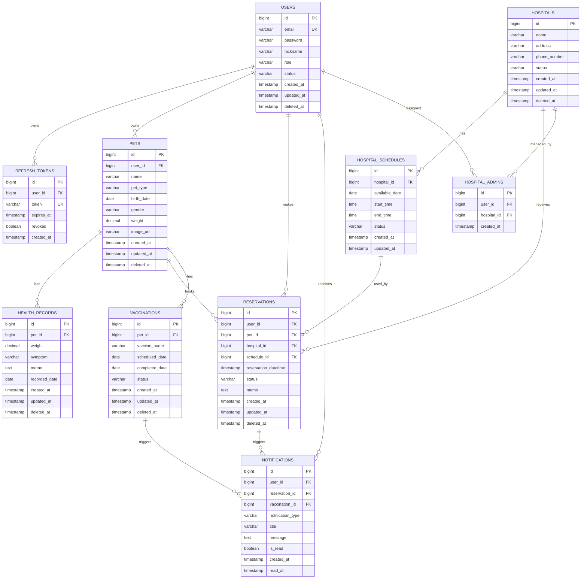

# 06_ERD

# **ERD設計書**

## **ドキュメント情報**

| **項目** | **内容** |
| --- | --- |
| Project | 大ペット（だいペット） |
| Document | ERD |
| Author | Koh Hanyeong |
| Status | Draft |
| Updated | 2026-05-17 |

---

# **1. ERD概要**

本ドキュメントでは、「大ペット」における主要テーブル、リレーション、制約、論理名、物理名を定義する。

本システムでは、ユーザー、認証トークン、ペット、病院、予約可能時間、予約、健康記録、ワクチン接種予定、通知情報を管理する。

---

# **2. ERD全体図**

---

# **3. テーブル一覧**

| **論理テーブル名** | **物理テーブル名** | **説明** |
| --- | --- | --- |
| ユーザー | users | システム利用者情報 |
| リフレッシュトークン | refresh_tokens | Refresh Token管理 |
| ペット | pets | ユーザーが飼育するペット情報 |
| 病院 | hospitals | 動物病院情報 |
| 病院予約枠 | hospital_schedules | 病院の予約可能時間 |
| 病院管理者 | hospital_admins | 病院と管理者の紐付け |
| 予約 | reservations | 病院予約情報 |
| 健康記録 | health_records | ペットの健康記録 |
| ワクチン接種予定 | vaccinations | ワクチン接種予定・完了情報 |
| 通知 | notifications | ユーザー向け通知情報 |

---

# **4. 命名規則**

| **対象** | **ルール** |
| --- | --- |
| Table | snake_case / 複数形 |
| Column | snake_case |
| Primary Key | id |
| Foreign Key | {参照先単数形}_id |
| 日時項目 | created_at, updated_at, deleted_at |
| ID採番 | PostgreSQL Identity Column |

---

# **5. 共通カラム方針**

| **論理名** | **物理名** | **Type** | **Null** | **Default** | **説明** |
| --- | --- | --- | --- | --- | --- |
| 作成日時 | created_at | TIMESTAMP | NO | CURRENT_TIMESTAMP | データ作成日時 |
| 更新日時 | updated_at | TIMESTAMP | NO | CURRENT_TIMESTAMP | データ更新日時 |
| 論理削除日時 | deleted_at | TIMESTAMP | YES | NULL | 論理削除日時 |

---

# **6. users**

## **概要**

システム利用者情報を管理する。

| **論理名** | **物理名** | **Type** | **PK** | **FK** | **Null** | **Unique** | **Default** | **説明** |
| --- | --- | --- | --- | --- | --- | --- | --- | --- |
| ユーザーID | id | BIGINT | ○ |  | NO | ○ | GENERATED BY DEFAULT AS IDENTITY | ユーザー識別子 |
| メールアドレス | email | VARCHAR(255) |  |  | NO | ○ |  | ログインID |
| パスワード | password | VARCHAR(255) |  |  | NO |  | BCrypt暗号化値 |  |
| ニックネーム | nickname | VARCHAR(50) |  |  | NO |  | 表示名 |  |
| Role | role | VARCHAR(30) |  |  | NO |  | USER | 権限種別 |
| ステータス | status | VARCHAR(30) |  |  | NO |  | ACTIVE | 利用状態 |
| 作成日時 | created_at | TIMESTAMP |  |  | NO |  | CURRENT_TIMESTAMP | 作成日時 |
| 更新日時 | updated_at | TIMESTAMP |  |  | NO |  | CURRENT_TIMESTAMP | 更新日時 |
| 論理削除日時 | deleted_at | TIMESTAMP |  |  | YES |  | NULL | 論理削除日時 |

---

# **7. refresh_tokens**

## **概要**

Refresh Tokenを管理する。

ログアウト、Token再発行、Token失効制御のために利用する。

| **論理名** | **物理名** | **Type** | **PK** | **FK** | **Null** | **Unique** | **Default** | **説明** |
| --- | --- | --- | --- | --- | --- | --- | --- | --- |
| トークンID | id | BIGINT | ○ |  | NO | ○ | GENERATED BY DEFAULT AS IDENTITY | Token識別子 |
| ユーザーID | user_id | BIGINT |  | ○ | NO |  |  | users.id |
| トークン値 | token | VARCHAR(500) |  |  | NO | ○ |  | Refresh Token値 |
| 有効期限 | expires_at | TIMESTAMP |  |  | NO |  |  | Token有効期限 |
| 失効フラグ | revoked | BOOLEAN |  |  | NO |  | false | 失効状態 |
| 作成日時 | created_at | TIMESTAMP |  |  | NO |  | CURRENT_TIMESTAMP | 作成日時 |

---

# **8. pets**

| **論理名** | **物理名** | **Type** | **PK** | **FK** | **Null** | **Unique** | **Default** | **説明** |
| --- | --- | --- | --- | --- | --- | --- | --- | --- |
| ペットID | id | BIGINT | ○ |  | NO | ○ | GENERATED BY DEFAULT AS IDENTITY | ペット識別子 |
| ユーザーID | user_id | BIGINT |  | ○ | NO |  |  | 飼い主ユーザーID |
| ペット名 | name | VARCHAR(50) |  |  | NO |  |  | ペット名 |
| ペット種別 | pet_type | VARCHAR(30) |  |  | NO |  |  | 犬・猫など |
| 生年月日 | birth_date | DATE |  |  | YES |  | NULL | 生年月日 |
| 性別 | gender | VARCHAR(20) |  |  | YES |  | NULL | 性別 |
| 体重 | weight | DECIMAL(5,2) |  |  | YES |  | NULL | 体重 |
| 画像URL | image_url | VARCHAR(500) |  |  | YES |  | NULL | ペット画像URL |
| 作成日時 | created_at | TIMESTAMP |  |  | NO |  | CURRENT_TIMESTAMP | 作成日時 |
| 更新日時 | updated_at | TIMESTAMP |  |  | NO |  | CURRENT_TIMESTAMP | 更新日時 |
| 論理削除日時 | deleted_at | TIMESTAMP |  |  | YES |  | NULL | 論理削除日時 |

---

# **9. hospitals**

| **論理名** | **物理名** | **Type** | **PK** | **FK** | **Null** | **Unique** | **Default** | **説明** |
| --- | --- | --- | --- | --- | --- | --- | --- | --- |
| 病院ID | id | BIGINT | ○ |  | NO | ○ | GENERATED BY DEFAULT AS IDENTITY | 病院識別子 |
| 病院名 | name | VARCHAR(100) |  |  | NO |  |  | 病院名 |
| 住所 | address | VARCHAR(255) |  |  | NO |  |  | 病院住所 |
| 電話番号 | phone_number | VARCHAR(30) |  |  | YES |  | NULL | 連絡先 |
| ステータス | status | VARCHAR(30) |  |  | NO |  | ACTIVE | 利用状態 |
| 作成日時 | created_at | TIMESTAMP |  |  | NO |  | CURRENT_TIMESTAMP | 作成日時 |
| 更新日時 | updated_at | TIMESTAMP |  |  | NO |  | CURRENT_TIMESTAMP | 更新日時 |
| 論理削除日時 | deleted_at | TIMESTAMP |  |  | YES |  | NULL | 論理削除日時 |

---

# **10. hospital_schedules**

## **概要**

病院の予約可能時間を管理する。

予約申請時、ユーザーはこの予約枠を選択する。

| **論理名** | **物理名** | **Type** | **PK** | **FK** | **Null** | **Unique** | **Default** | **説明** |
| --- | --- | --- | --- | --- | --- | --- | --- | --- |
| 予約枠ID | id | BIGINT | ○ |  | NO | ○ | GENERATED BY DEFAULT AS IDENTITY | 予約枠識別子 |
| 病院ID | hospital_id | BIGINT |  | ○ | NO |  |  | hospitals.id |
| 予約可能日 | available_date | DATE |  |  | NO |  |  | 予約可能日 |
| 開始時刻 | start_time | TIME |  |  | NO |  |  | 予約開始時刻 |
| 終了時刻 | end_time | TIME |  |  | NO |  |  | 予約終了時刻 |
| 予約枠ステータス | status | VARCHAR(30) |  |  | NO |  | AVAILABLE | AVAILABLE / BLOCKED |
| 作成日時 | created_at | TIMESTAMP |  |  | NO |  | CURRENT_TIMESTAMP | 作成日時 |
| 更新日時 | updated_at | TIMESTAMP |  |  | NO |  | CURRENT_TIMESTAMP | 更新日時 |

---

# **11. hospital_admins**

| **論理名** | **物理名** | **Type** | **PK** | **FK** | **Null** | **Unique** | **Default** | **説明** |
| --- | --- | --- | --- | --- | --- | --- | --- | --- |
| 病院管理者ID | id | BIGINT | ○ |  | NO | ○ | GENERATED BY DEFAULT AS IDENTITY | 紐付け識別子 |
| ユーザーID | user_id | BIGINT |  | ○ | NO |  |  | 病院管理者ユーザーID |
| 病院ID | hospital_id | BIGINT |  | ○ | NO |  |  | 管理対象病院ID |
| 作成日時 | created_at | TIMESTAMP |  |  | NO |  | CURRENT_TIMESTAMP | 作成日時 |

### **制約**

| **制約** | **内容** |
| --- | --- |
| UNIQUE | user_id, hospital_id |

---

# **12. reservations**

| **論理名** | **物理名** | **Type** | **PK** | **FK** | **Null** | **Unique** | **Default** | **説明** |
| --- | --- | --- | --- | --- | --- | --- | --- | --- |
| 予約ID | id | BIGINT | ○ |  | NO | ○ | GENERATED BY DEFAULT AS IDENTITY | 予約識別子 |
| ユーザーID | user_id | BIGINT |  | ○ | NO |  |  | 予約者ID |
| ペットID | pet_id | BIGINT |  | ○ | NO |  |  | 予約対象ペットID |
| 病院ID | hospital_id | BIGINT |  | ○ | NO |  |  | 予約先病院ID |
| 予約枠ID | schedule_id | BIGINT |  | ○ | NO |  |  | hospital_schedules.id |
| 予約日時 | reservation_datetime | TIMESTAMP |  |  | NO |  |  | 予約日時 |
| 予約ステータス | status | VARCHAR(30) |  |  | NO |  | REQUESTED | 予約状態 |
| メモ | memo | TEXT |  |  | YES |  | NULL | 予約メモ |
| 作成日時 | created_at | TIMESTAMP |  |  | NO |  | CURRENT_TIMESTAMP | 作成日時 |
| 更新日時 | updated_at | TIMESTAMP |  |  | NO |  | CURRENT_TIMESTAMP | 更新日時 |
| 論理削除日時 | deleted_at | TIMESTAMP |  |  | YES |  | NULL | 論理削除日時 |

### **業務制約**

| **制約** | **内容** |
| --- | --- |
| 重複予約防止 | 同一予約枠に対してREQUESTED / APPROVED状態の予約は1件のみ許可 |
| 過去日時禁止 | 現在時刻より過去の予約不可 |
| 状態遷移制御 | Service層で不正状態遷移を防止 |

---

# **13. health_records**

| **論理名** | **物理名** | **Type** | **PK** | **FK** | **Null** | **Unique** | **Default** | **説明** |
| --- | --- | --- | --- | --- | --- | --- | --- | --- |
| 健康記録ID | id | BIGINT | ○ |  | NO | ○ | GENERATED BY DEFAULT AS IDENTITY | 健康記録識別子 |
| ペットID | pet_id | BIGINT |  | ○ | NO |  |  | 対象ペットID |
| 体重 | weight | DECIMAL(5,2) |  |  | YES |  | NULL | 記録時点の体重 |
| 症状 | symptom | VARCHAR(255) |  |  | YES |  | NULL | 症状 |
| メモ | memo | TEXT |  |  | YES |  | NULL | 健康記録メモ |
| 記録日 | recorded_date | DATE |  |  | NO |  |  | 健康記録日 |
| 作成日時 | created_at | TIMESTAMP |  |  | NO |  | CURRENT_TIMESTAMP | 作成日時 |
| 更新日時 | updated_at | TIMESTAMP |  |  | NO |  | CURRENT_TIMESTAMP | 更新日時 |
| 論理削除日時 | deleted_at | TIMESTAMP |  |  | YES |  | NULL | 論理削除日時 |

---

# **14. vaccinations**

| **論理名** | **物理名** | **Type** | **PK** | **FK** | **Null** | **Unique** | **Default** | **説明** |
| --- | --- | --- | --- | --- | --- | --- | --- | --- |
| ワクチンID | id | BIGINT | ○ |  | NO | ○ | GENERATED BY DEFAULT AS IDENTITY | ワクチン情報識別子 |
| ペットID | pet_id | BIGINT |  | ○ | NO |  |  | 対象ペットID |
| ワクチン名 | vaccine_name | VARCHAR(100) |  |  | NO |  |  | ワクチン名称 |
| 接種予定日 | scheduled_date | DATE |  |  | NO |  |  | 接種予定日 |
| 接種完了日 | completed_date | DATE |  |  | YES |  | NULL | 接種完了日 |
| ワクチンステータス | status | VARCHAR(30) |  |  | NO |  | SCHEDULED | 接種状態 |
| 作成日時 | created_at | TIMESTAMP |  |  | NO |  | CURRENT_TIMESTAMP | 作成日時 |
| 更新日時 | updated_at | TIMESTAMP |  |  | NO |  | CURRENT_TIMESTAMP | 更新日時 |
| 論理削除日時 | deleted_at | TIMESTAMP |  |  | YES |  | NULL | 論理削除日時 |

---

# **15. notifications**

| **論理名** | **物理名** | **Type** | **PK** | **FK** | **Null** | **Unique** | **Default** | **説明** |
| --- | --- | --- | --- | --- | --- | --- | --- | --- |
| 通知ID | id | BIGINT | ○ |  | NO | ○ | GENERATED BY DEFAULT AS IDENTITY | 通知識別子 |
| ユーザーID | user_id | BIGINT |  | ○ | NO |  |  | 通知対象ユーザーID |
| 予約ID | reservation_id | BIGINT |  | ○ | YES |  | NULL | 関連予約ID |
| ワクチンID | vaccination_id | BIGINT |  | ○ | YES |  | NULL | 関連ワクチンID |
| 通知種別 | notification_type | VARCHAR(50) |  |  | NO |  |  | 通知種別 |
| 通知タイトル | title | VARCHAR(100) |  |  | NO |  |  | 通知タイトル |
| 通知本文 | message | TEXT |  |  | NO |  |  | 通知本文 |
| 既読フラグ | is_read | BOOLEAN |  |  | NO |  | false | 既読状態 |
| 作成日時 | created_at | TIMESTAMP |  |  | NO |  | CURRENT_TIMESTAMP | 作成日時 |
| 既読日時 | read_at | TIMESTAMP |  |  | YES |  | NULL | 既読日時 |

---

# **16. Status定義**

## **users.status**

| **Status** | **説明** |
| --- | --- |
| ACTIVE | 利用可能 |
| SUSPENDED | 利用停止 |

## **hospitals.status**

| **Status** | **説明** |
| --- | --- |
| ACTIVE | 利用可能 |
| SUSPENDED | 利用停止 |

## **hospital_schedules.status**

| **Status** | **説明** |
| --- | --- |
| AVAILABLE | 予約可能 |
| BLOCKED | 予約不可 |

## **reservations.status**

| **Status** | **説明** |
| --- | --- |
| REQUESTED | 予約申請中 |
| APPROVED | 承認済 |
| REJECTED | 却下 |
| COMPLETED | 診療完了 |
| CANCELLED | キャンセル |

## **vaccinations.status**

| **Status** | **説明** |
| --- | --- |
| SCHEDULED | 接種予定 |
| COMPLETED | 接種完了 |
| CANCELLED | キャンセル |

---

# **17. Index設計**

| **Table** | **Index** | **目的** |
| --- | --- | --- |
| users | email | ログイン検索 |
| refresh_tokens | token | Token検索 |
| refresh_tokens | user_id | ユーザー別Token検索 |
| pets | user_id | ユーザー別ペット検索 |
| hospital_schedules | hospital_id, available_date | 病院別予約枠検索 |
| reservations | user_id | ユーザー別予約検索 |
| reservations | hospital_id | 病院別予約検索 |
| reservations | schedule_id | 予約枠重複確認 |
| health_records | pet_id | ペット別健康記録検索 |
| vaccinations | scheduled_date | Scheduler対象検索 |
| notifications | user_id | ユーザー別通知検索 |
| notifications | is_read | 未読通知検索 |

---

# **18. 設計上の考慮事項**

## **Refresh Token管理**

Refresh TokenはDBで管理する。

ログアウト、Token再発行、Token失効制御を可能にするためである。

---

## **予約枠管理**

病院の予約可能時間は`hospital_schedules`で管理する。

これにより、病院ごとの休診日、予約不可時間、予約枠単位の制御が可能になる。

---

## **重複予約防止**

同一`schedule_id`に対して、`REQUESTED`または`APPROVED`状態の予約は1件のみ許可する。`REJECTED`、`CANCELLED`、`COMPLETED`は履歴として保持する。

---

## **論理削除**

予約、健康記録、ワクチン情報は履歴性が高いため、物理削除ではなく論理削除を基本とする。

---

## **通知設計**

通知は予約またはワクチンに関連する可能性があるため、`reservation_id`、`vaccination_id`はnullableとする.

---