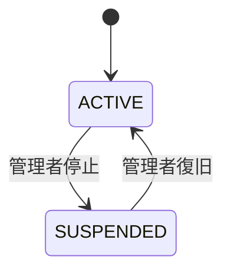
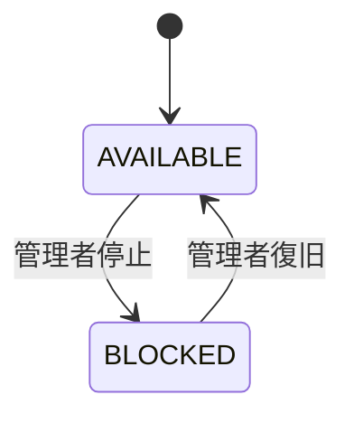
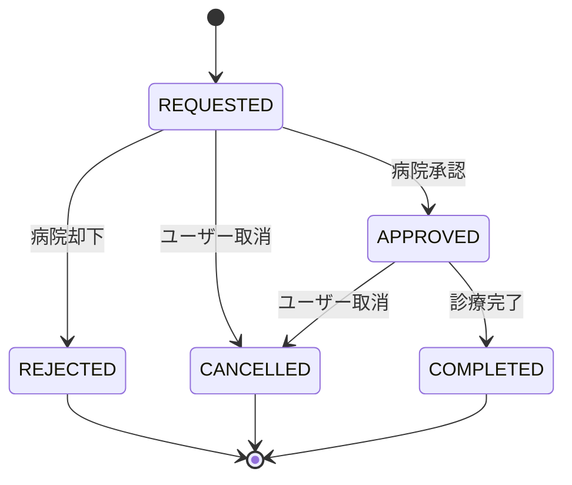
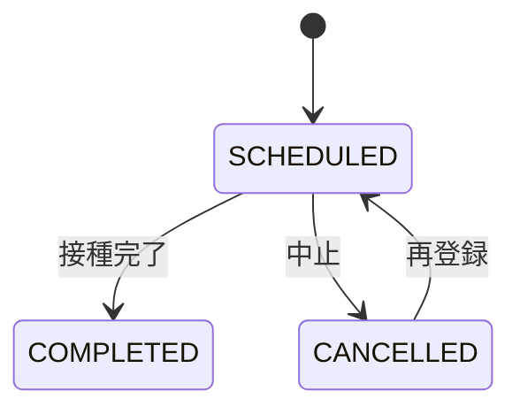
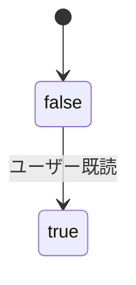
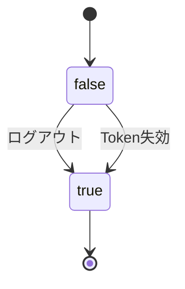
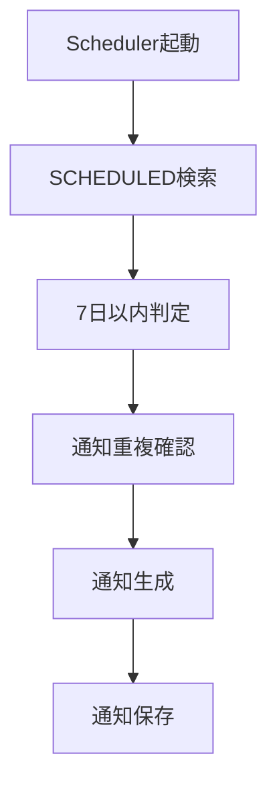

# 08_State_Design

# **状態設計書**

## **ドキュメント情報**

| **項目** | **内容** |
| --- | --- |
| Project | 大ペット（だいペット） |
| Document | State Design |
| Author | Koh Hanyeong |
| Status | Draft |
| Updated | 2026-05-17 |

---

# **1. 状態設計概要**

本ドキュメントでは、「大ペット」における主要状態値（Status）および状態遷移ルールを定義する。

本システムでは以下の状態管理を行う。

- ユーザー状態
- 病院状態
- 病院予約枠状態
- 予約状態
- ワクチン状態
- 通知既読状態
- Refresh Token状態

状態遷移は業務ルールと密接に関係するため、Service層で厳密に制御する。

---

# **2. 状態管理対象一覧**

| **管理対象** | **カラム** |
| --- | --- |
| users | status |
| hospitals | status |
| hospital_schedules | status |
| reservations | status |
| vaccinations | status |
| notifications | is_read |
| refresh_tokens | revoked |

---

# **3. users.status**

# **3-1. 状態一覧**

| **Status** | **説明** |
| --- | --- |
| ACTIVE | 利用可能状態 |
| SUSPENDED | 利用停止状態 |

---

# **3-2. 状態遷移図**



---

# **3-3. 状態遷移ルール**

| **現在状態** | **次状態** | **実行者** | **条件** |
| --- | --- | --- | --- |
| ACTIVE | SUSPENDED | ROLE_SYSTEM_ADMIN | 管理者停止 |
| SUSPENDED | ACTIVE | ROLE_SYSTEM_ADMIN | 復旧処理 |

---

# **3-4. 制約事項**

| **条件** | **内容** |
| --- | --- |
| SUSPENDED | ログイン不可 |
| SUSPENDED | API利用不可 |

---

# **4. hospitals.status**

# **4-1. 状態一覧**

| **Status** | **説明** |
| --- | --- |
| ACTIVE | 利用可能 |
| SUSPENDED | 利用停止 |

---

# **4-2. 状態遷移図**


---

# **4-3. 制約事項**

| **条件** | **内容** |
| --- | --- |
| SUSPENDED | 新規予約不可 |
| SUSPENDED | 病院一覧表示対象外 |

---

# **5. hospital_schedules.status**

# **5-1. 状態一覧**

| **Status** | **説明** |
| --- | --- |
| AVAILABLE | 予約可能 |
| BLOCKED | 予約不可 |

---

# **5-2. 状態遷移図**



---

# **5-3. 制約事項**

| **条件** | **内容** |
| --- | --- |
| BLOCKED | 予約申請不可 |
| BLOCKED | 一覧表示可能 |
| BLOCKED | 過去予約履歴は保持 |

---

# **6. reservations.status**

# **6-1. 状態一覧**

| **Status** | **説明** |
| --- | --- |
| REQUESTED | 予約申請中 |
| APPROVED | 承認済 |
| REJECTED | 却下 |
| COMPLETED | 診療完了 |
| CANCELLED | キャンセル |

---

# **6-2. 状態遷移図**



---

# **6-3. 状態遷移ルール**

| **現在状態** | **次状態** | **実行者** | **条件** |
| --- | --- | --- | --- |
| REQUESTED | APPROVED | ROLE_HOSPITAL_ADMIN | 承認処理 |
| REQUESTED | REJECTED | ROLE_HOSPITAL_ADMIN | 却下処理 |
| REQUESTED | CANCELLED | ROLE_USER | キャンセル |
| APPROVED | COMPLETED | ROLE_HOSPITAL_ADMIN | 診療完了 |
| APPROVED | CANCELLED | ROLE_USER | 診療前取消 |

---

# **6-4. 不正状態遷移**

以下の状態遷移は禁止する。

| 禁止遷移 |
| --- |
| COMPLETED → REQUESTED |
| CANCELLED → APPROVED |
| REJECTED → APPROVED |
| COMPLETED → CANCELLED |

---

# **6-5. 制約事項**

| **条件** | **内容** |
| --- | --- |
| REQUESTED | 同一schedule_idに1件のみ許可 |
| APPROVED | 同一schedule_idに1件のみ許可 |
| REJECTED | 再予約可能 |
| CANCELLED | 再予約可能 |

---

# **6-6. 通知連携**

| **状態変更** | **通知** |
| --- | --- |
| APPROVED | RESERVATION_APPROVED |
| REJECTED | RESERVATION_REJECTED |
| COMPLETED | TREATMENT_COMPLETED |

---

# **7. vaccinations.status**

# **7-1. 状態一覧**

| **Status** | **説明** |
| --- | --- |
| SCHEDULED | 接種予定 |
| COMPLETED | 接種完了 |
| CANCELLED | キャンセル |

---

# **7-2. 状態遷移図**



---

# **7-3. 制約事項**

| **条件** | **内容** |
| --- | --- |
| SCHEDULED | Scheduler通知対象 |
| COMPLETED | 通知対象外 |
| CANCELLED | 通知対象外 |

---

# **8. notifications.is_read**

# **8-1. 状態一覧**

| **値** | **説明** |
| --- | --- |
| false | 未読 |
| true | 既読 |

---

# **8-2. 状態遷移図**



---

# **8-3. 制約事項**

| **条件** | **内容** |
| --- | --- |
| false | 未読件数対象 |
| true | 未読件数対象外 |

---

# **9. refresh_tokens.revoked**

# **9-1. 状態一覧**

| **値** | **説明** |
| --- | --- |
| false | 有効 |
| true | 失効 |

---

# **9-2. 状態遷移図**



---

# **9-3. 制約事項**

| **条件** | **内容** |
| --- | --- |
| revoked=true | Refresh不可 |
| revoked=true | 再利用不可 |

---

# **10. Role別状態変更権限**

| **状態変更** | **ROLE_USER** | **ROLE_HOSPITAL_ADMIN** | **ROLE_SYSTEM_ADMIN** |
| --- | --- | --- | --- |
| 予約取消 | ○ | × | ○ |
| 予約承認 | × | ○ | ○ |
| 診療完了 | × | ○ | ○ |
| ユーザー停止 | × | × | ○ |
| 病院停止 | × | × | ○ |
| 予約枠停止 | × | ○ | ○ |

---

# **11. Scheduler連携**

# **11-1. ワクチン通知Scheduler**

## **実行時間**

```
毎日 09:00
```

---

## **対象条件**

| **条件** | **内容** |
| --- | --- |
| vaccinations.status | SCHEDULED |
| scheduled_date | 7日以内 |
| notification未作成 | 重複通知防止 |

---

# **11-2. Schedulerフロー**



---

# **12. API連携ポイント**

| **状態** | **関連API** |
| --- | --- |
| reservations.status | Reservation API |
| vaccinations.status | Vaccination Scheduler |
| notifications.is_read | Notification API |
| refresh_tokens.revoked | Auth API |

---

# **13. DB連携ポイント**

| **テーブル** | **状態カラム** |
| --- | --- |
| users | status |
| hospitals | status |
| hospital_schedules | status |
| reservations | status |
| vaccinations | status |
| notifications | is_read |
| refresh_tokens | revoked |

---

# **14. Logging対象状態変更**

以下の状態変更は監査ログ対象とする。

| **対象** | **ログ内容** |
| --- | --- |
| reservations.status | 状態変更履歴 |
| users.status | 停止履歴 |
| hospitals.status | 利用停止履歴 |
| refresh_tokens.revoked | Token失効履歴 |

---

# **15. 設計上考慮事項**

## **状態管理一元化**

状態変更はControllerではなくService層で管理する。

---

## **不正状態遷移防止**

不正状態遷移はAPIレベルではなく業務ロジックレベルで防止する。

---

## **履歴保持**

COMPLETED、CANCELLED、REJECTED状態の予約は削除せず履歴として保持する。

---

## **Scheduler整合性**

Scheduler対象データは状態値ベースで判定する。

---

# **16. 今後拡張予定状態**

| **管理対象** | **追加候補** |
| --- | --- |
| reservations | NO_SHOW |
| notifications | ARCHIVED |
| users | WITHDRAWN |
| hospital_schedules | HOLIDAY |

---