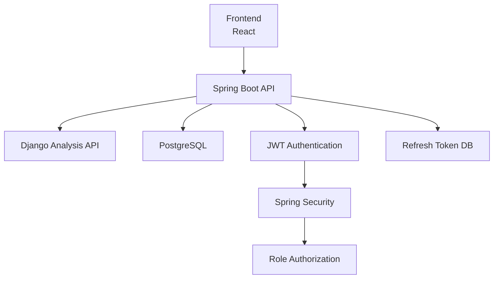
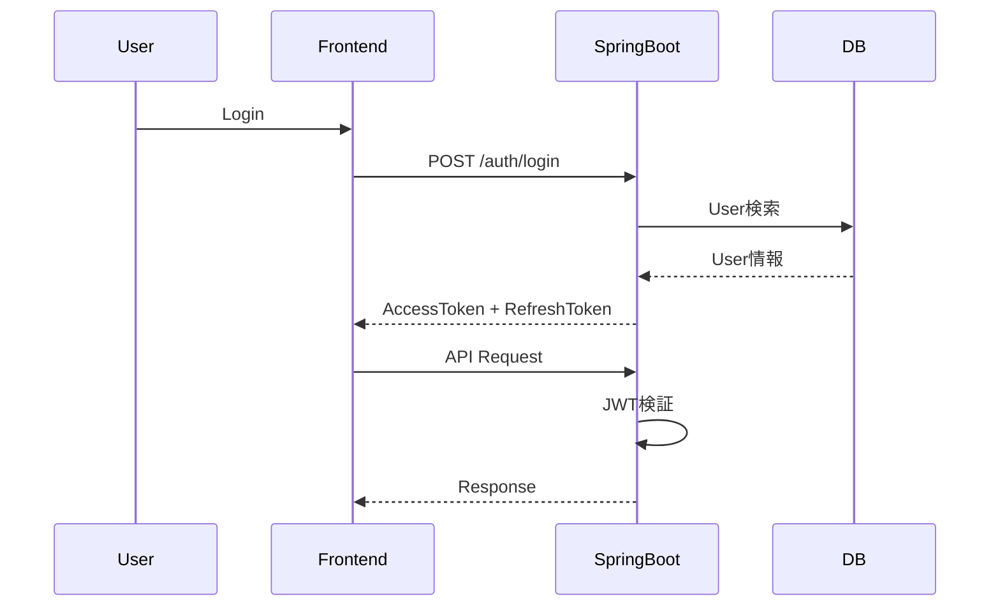
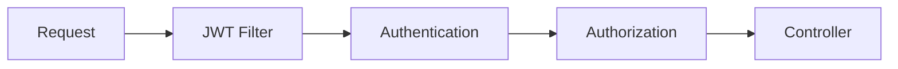
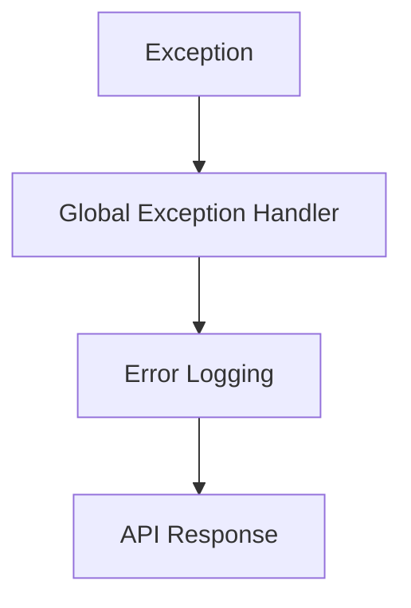

# 09_Security_Design

# **セキュリティ設計書**

## **ドキュメント情報**

| **項目** | **内容** |
| --- | --- |
| Project | 大ペット（だいペット） |
| Document | Security Design |
| Author | Koh Hanyeong |
| Status | Draft |
| Updated | 2026-05-17 |

---

# **1. セキュリティ設計概要**

本ドキュメントでは、「大ペット」におけるセキュリティ設計方針を定義する。

本システムでは以下のセキュリティ対策を実施する。

- JWT認証
- Role Based Authorization
- Password暗号化
- Refresh Token管理
- HTTPS通信
- CORS制御
- 入力値Validation
- SQL Injection対策
- XSS対策
- CSRF対策
- Logging監査
- Rate Limit対策

---

# **2. セキュリティアーキテクチャ**



---

# **3. 認証設計**

# **3-1. 認証方式**

JWT Bearer Authenticationを利用する。

```
Authorization: Bearer {access_token}
```

---

# **3-2. Token構成**

| **Token** | **用途** | **保存場所** | **送受信方式** |
| --- | --- | --- | --- |
| Access Token | API認証 | Frontend Memory | Authorization Header (Bearer) |
| Refresh Token | Token再発行 | Frontend State | Request Body / Response Body |

> **注記（MVP方針）:** Refresh TokenはMVP段階ではRequest Body方式で実装する。セキュリティ強化フェーズでHttpOnly Cookie方式への移行を検討する。

---

# **3-3. Token有効期限**

| **Token** | **有効期限** |
| --- | --- |
| Access Token | 30分 |
| Refresh Token | 14日 |

---

# **3-4. Refresh Token管理**

Refresh TokenはDBで管理する。

対象テーブル:

```
refresh_tokens
```

---

# **3-5. Refresh Token失効条件**

| **条件** | **内容** |
| --- | --- |
| Logout | revoked=true |
| Token再発行 | 旧Token失効 |
| 有効期限超過 | 使用不可 |

---

# **3-6. 認証フロー**



---

# **4. Authorization設計**

# **4-1. 認可方式**

Role Based Authorizationを採用する。

---

# **4-2. Role一覧**

| **Role** | **説明** |
| --- | --- |
| ROLE_USER | 一般利用者 |
| ROLE_HOSPITAL_ADMIN | 病院管理者 |
| ROLE_SYSTEM_ADMIN | システム管理者 |

---

# **4-3. 権限制御対象**

| **API** | **ROLE_USER** | **ROLE_HOSPITAL_ADMIN** | **ROLE_SYSTEM_ADMIN** |
| --- | --- | --- | --- |
| ペット登録 | ○ | × | ○ |
| 予約申請 | ○ | × | ○ |
| 予約承認 | × | ○ | ○ |
| 病院管理 | × | × | ○ |

---

# **4-4. Spring Security設定方針**



---

# **5. Password管理**

# **5-1. Password暗号化**

BCryptを利用する。

```mermaid
BCryptPasswordEncoder
```

---

# **5-2. Passwordポリシー**

| **項目** | **内容** |
| --- | --- |
| 最小文字数 | 8文字 |
| 英数字混在 | 必須 |
| 平文保存 | 禁止 |

---

# **5-3. Password保存方針**

| **項目** | **内容** |
| --- | --- |
| DB保存 | Hash化 |
| ログ出力 | 禁止 |
| API Response | 禁止 |

---

# **6. HTTPS設計**

# **6-1. HTTPS必須化**

本番環境ではHTTPS通信を必須とする。

---

# **6-2. Cookie設定**

> **注記（MVP方針）:** MVP段階ではRefresh TokenをRequest Body方式で実装するため、Cookie設定は本番移行時に適用する。

| **項目** | **値** | **適用フェーズ** |
| --- | --- | --- |
| HttpOnly | true | 本番移行時 |
| Secure | true | 本番移行時 |
| SameSite | Strict | 本番移行時 |

---

# **7. CORS設計**

# **7-1. 許可Origin**

| **環境** | **Origin** |
| --- | --- |
| Local | http://localhost:5173 |
| Production | https://daipetto.example.com |

---

# **7-2. 許可Method**

- GET
- POST
- PUT
- PATCH
- DELETE

---

# **8. CSRF対策**

# **8-1. CSRF方針**

JWT認証を利用するため、Spring Security標準CSRFは無効化する。

---

# **8-2. Refresh Token送受信方式**

MVP段階ではRefresh TokenをRequest Body / Response Bodyで送受信する。

| **フェーズ** | **方式** | **CSRF対策** |
| --- | --- | --- |
| MVP | Request Body / Response Body | JWT Stateless認証によりCSRFリスク限定的 |
| 本番移行時 | HttpOnly Cookie (SameSite=Strict) | Cookie設定によりCSRF低減・XSSリスク排除 |

---

# **9. XSS対策**

# **9-1. 対策方針**

| **対策** | **内容** |
| --- | --- |
| React利用 | 基本Escape |
| dangerouslySetInnerHTML | 原則禁止 |
| 入力Validation | HTML制限 |

---

# **9-2. 禁止事項**

- HTML直接保存
- Script Tag許可

---

# **10. SQL Injection対策**

# **10-1. Spring Boot**

JPA Parameter Bindingを利用する。

---

# **10-2. Django**

Django ORMを利用する。

---

# **10-3. 禁止事項**

- String連結SQL
- Native Query乱用

---

# **11. Validation設計**

# **11-1. Backend Validation**

Spring Validationを利用する。

```java
@Valid
@NotNull
@Size
@Email
```

---

# **11-2. Validation対象**

| **項目** | **条件** |
| --- | --- |
| Email | RFC形式 |
| Password | 8文字以上 |
| Pet Name | 20文字以内 |
| Memo | 1000文字以内 |

---

# **11-3. Frontend Validation**

React Form Validationを実施する。

---

# **12. Rate Limit設計**

# **12-1. Rate Limit対象**

| **API** | **制限** |
| --- | --- |
| Login API | 5回 / 1分 |
| Refresh API | 10回 / 1分 |

---

# **12-2. 異常検知**

以下を監視対象とする。

- Login連続失敗
- Token異常利用
- 予約大量生成

---

# **13. Logging・監査設計**

# **13-1. 監査ログ対象**

| **対象** | **内容** |
| --- | --- |
| Login | 認証成功/失敗 |
| Reservation | 状態変更 |
| User Status | 停止/復旧 |
| Hospital Status | 停止/復旧 |

---

# **13-2. ログ禁止情報**

- Password
- JWT全文
- Refresh Token全文
- 個人情報全文

---

# **13-3. Error Logging**



---

# **14. ファイルUploadセキュリティ**

# **14-1. 対象**

ペット画像Upload

---

# **14-2. 制限**

| **項目** | **内容** |
| --- | --- |
| 拡張子 | jpg/png/webp |
| 最大サイズ | 5MB |
| MIME Type検証 | 必須 |

---

# **14-3. 保存方針**

| **項目** | **内容** |
| --- | --- |
| Local保存 | 禁止 |
| Object Storage | 利用 |
| URL保存 | DB保存 |

---

# **15. Schedulerセキュリティ**

# **15-1. Scheduler対象**

| **Scheduler** | **用途** |
| --- | --- |
| ワクチン通知 | 通知生成 |

---

# **15-2. 制御方針**

| **項目** | **内容** |
| --- | --- |
| 重複通知防止 | 必須 |
| Transaction管理 | 必須 |
| Error Logging | 必須 |

---

# **16. DBセキュリティ**

# **16-1. DB接続**

| **項目** | **内容** |
| --- | --- |
| ORM | JPA / Django ORM |
| DB User権限 | 最小権限 |
| Root接続 | 禁止 |

---

# **16-2. 論理削除**

履歴保持のため論理削除を採用する。

---

# **17. Docker Security**

# **17-1. Container構成**

| **Container** | **用途** |
| --- | --- |
| frontend | React |
| spring-api | Spring Boot |
| django-api | Django |
| postgres | PostgreSQL |

---

# **17-2. Security方針**

| **項目** | **内容** |
| --- | --- |
| 不要Port公開 | 禁止 |
| ENV直書き | 禁止 |
| Secret管理 | .env利用 |

---

# **18. エラーレスポンス設計**

## **Response形式**

```json
{
  "success": false,
  "data": null,
  "code": "AUTH-001",
  "message": "認証に失敗しました。"
}
```

---

# **19. セキュリティ監視対象**

| **対象** | **内容** |
| --- | --- |
| Login Fail | 異常認証 |
| API Error | 500監視 |
| Scheduler Error | 通知異常 |
| DB Error | 接続異常 |

---

# **20. 設計上考慮事項**

## **Access Token短期化**

Access Tokenは短期有効期限とし、漏洩リスクを低減する。

---

## **Refresh Token DB管理**

強制Logout、Token失効制御を可能にするためDB管理する。

---

## **状態遷移保護**

状態変更APIはRole権限および状態遷移ルールで制御する。

---

## **API責務分離**

認証・予約などの業務APIはSpring Boot、分析系APIはDjango REST Frameworkで管理する。

---

# **21. 今後追加予定セキュリティ**

| **項目** | **内容** |
| --- | --- |
| MFA | 二段階認証 |
| WAF | Web Application Firewall |
| API Gateway | Rate Limit強化 |
| Redis Blacklist | JWT失効管理 |
| Security Header | CSP / HSTS |

---