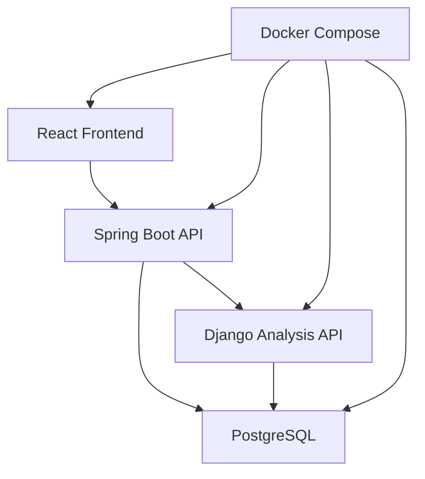
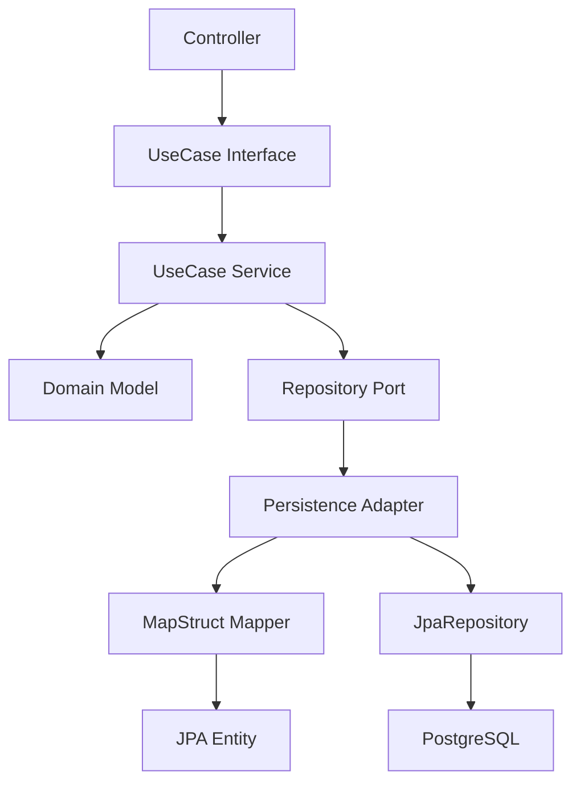
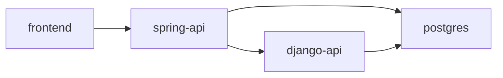
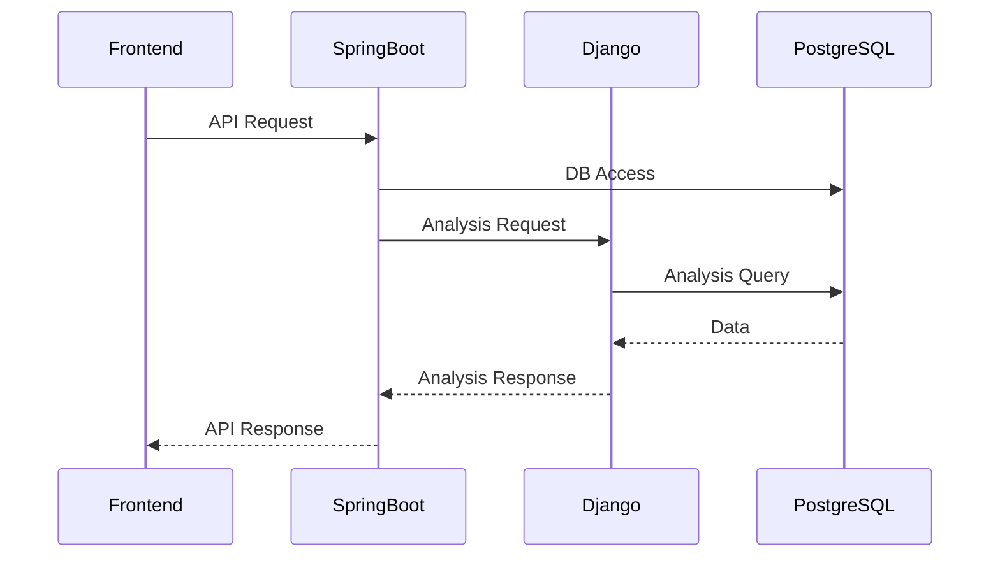
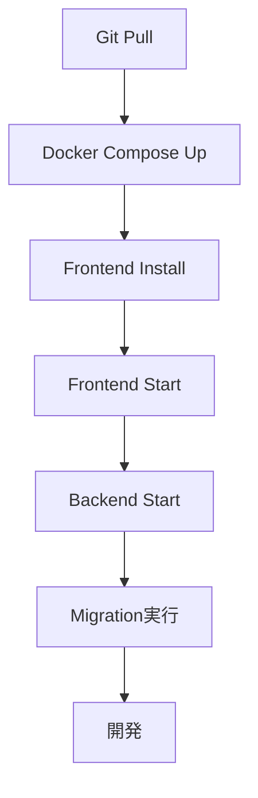

# 10_Development_Environment

# **開発環境設計書**

## **ドキュメント情報**

| **項目** | **内容** |
| --- | --- |
| Project | 大ペット（だいペット） |
| Document | Development Environment |
| Author | Koh Hanyeong |
| Status | Draft |
| Updated | 2026-08-23 |

---

# **1. 開発環境概要**

本ドキュメントでは、「大ペット」における開発環境、ローカル実行環境、Docker構成、使用ツール、開発ルールを定義する。

本システムでは以下構成を採用する。

- Frontend: React + Vite
- Backend: Spring Boot / Django REST Framework
- Database: PostgreSQL
- Infrastructure: Docker Compose

本プロジェクトは、実務で利用実績が多い安定バージョン（LTS・Long Term Support）を中心に選定する。

---

# **2. システム構成**



---

# **3. 開発環境一覧**

| **区分** | **技術** | **Version** |
| --- | --- | --- |
| Frontend Framework | React | 18.3.1 |
| Frontend Language | TypeScript | 5.7.3 |
| Frontend Build Tool | Vite | 6.4.3 |
| Frontend Runtime | Node.js | 24.17.0 |
| Package Manager | npm | 11.13.0 |
| CSS Framework | Tailwind CSS | 3.4.19 |
| State Management | Zustand | 5.0.14 |
| HTTP Client | Axios | 1.18.1 |
| Routing | React Router DOM | 6.30.4 |
| Mobile | Capacitor（Android / iOS） | 8.4.1 |
| Backend Language | Java | 17 |
| Backend Framework | Spring Boot | 3.3.13 |
| Security | Spring Security | 6.3.x |
| ORM | Spring Data JPA | Included |
| Migration | Flyway | 10.20.x |
| Backend Language | Python | 3.12.10 |
| Python Framework | Django REST Framework | 3.15.2 |
| Database | PostgreSQL | 16.9 |
| Infrastructure | Docker Compose | v2 |
| API | REST API | JSON |
| Documentation | Notion | Latest |
| UI Design | Google Stitch | Latest |

---

# **4. Frontend環境**

# **4-1. 技術構成**

| **項目** | **バージョン** | **用途** |
| --- | --- | --- |
| React | 18.3.1 | UIフレームワーク |
| TypeScript | 5.7.3 | 型安全性 |
| Vite | 6.4.3 | ビルドツール |
| Tailwind CSS | 3.4.19 | スタイリング |
| React Router DOM | 6.30.4 | ルーティング |
| Axios | 1.18.1 | HTTP通信（JWT自動付与・リフレッシュ対応） |
| Zustand | 5.0.14 | 状態管理（Auth・Pet・Hospital） |
| Capacitor | 8.4.1 | Android / iOS ネイティブラッパー |

---

# **4-2. Node Version**

```
Node.js 24.17.0
```

---

# **4-3. npm Version**

```
npm 11.13.0
```

---

# **4-4. Frontend Port**

| **用途** | **Port** |
| --- | --- |
| Frontend | 5173 |

---

# **4-5. Frontend Directory構成**

```
frontend/
├── src/
│   ├── api/           # axios client + 各APIモジュール
│   │   ├── client.ts  # axiosインスタンス (JWT付与・401リフレッシュ・プラットフォーム別ベースURL)
│   │   ├── auth.ts    # 認証API
│   │   ├── pet.ts     # ペットAPI
│   │   └── hospital.ts # 病院API（公開4 + 管理者6）
│   ├── components/
│   │   ├── layout/    # MainLayout / DetailLayout / BottomNav / TopAppBar
│   │   └── auth/      # ProtectedRoute（認証・ロールガード）
│   ├── pages/
│   │   └── admin/     # 管理者画面
│   ├── stores/        # Zustand ストア
│   │   ├── authStore.ts
│   │   ├── petStore.ts
│   │   └── hospitalStore.ts
│   ├── types/         # TypeScript型定義
│   │   ├── common.ts  # ApiResponse
│   │   ├── auth.ts
│   │   ├── pet.ts
│   │   └── hospital.ts
│   ├── App.tsx        # ルーター設定 + 起動時トークン復元
│   └── main.tsx
├── android/ ios/      # Capacitor ネイティブプロジェクト
├── .env.local         # VITE_API_BASE_URL_WEB / _ANDROID / _IOS
└── package.json
```

---

# **4-6. Node.js Version管理**

Node.js Version管理には `nvm` を利用する。

```
nvm install 24
nvm use 24
nvm alias default 24
```

---

# **5. Spring Boot環境**

# **5-1. 技術構成**

| **項目** | **内容** |
| --- | --- |
| Language | Java 17 |
| Framework | Spring Boot 3.3.13 |
| Security | Spring Security |
| ORM | Spring Data JPA |
| Build Tool | Gradle |
| Migration | Flyway |

---

# **5-2. Java Version**

```
Java 17
```

---

# **5-3. Spring Boot Version**

```
Spring Boot 3.3.13
```

---

# **5-4. Gradle Version**

```
Gradle 8.14.4
```

---

# **5-5. Backend Port**

| **用途** | **Port** |
| --- | --- |
| Spring Boot API | 8080 |

---

# **5-6. Backend Directory構成**

Domain と JPA Entity を分離した Hexagonal-like 構造（詳細は `04_System_Architecture` §11 参照）。

```
spring-api/
├── src/main/java/koh/portfolio/springapi/
│   ├── common/          # exception (ErrorCode/CustomException/Preconditions/GlobalExceptionHandler),
│   │                    # response (ApiResponse), time (ServerTime)
│   ├── domain/{X}/      # model / exception / port（JPA非依存）
│   ├── application/{X}/ # dto / usecase (interface) / service (実装体)
│   ├── infrastructure/  # mapper (MapStruct), persistence/{X} (Entity/JpaRepository/Adapter),
│   │                    # security (jwt / handler / cors)
│   └── presentation/{X}/ # Controller
├── src/main/resources/
│   ├── db/migration/    # Flyway V1〜V7
│   └── application*.yml # local / docker プロファイル
└── build.gradle
```

---

# **5-7. Layer構成**



---

# **5-8. Spring Boot依存関係**

| **Dependency** | **用途** |
| --- | --- |
| spring-boot-starter-web | REST API |
| spring-boot-starter-security | 認証・認可 |
| spring-boot-starter-validation | Validation |
| spring-boot-starter-data-jpa | ORM |
| flyway-core / flyway-database-postgresql | Migration |
| postgresql | PostgreSQL Driver |
| jjwt (api / impl / jackson) 0.12.6 | JWT発行・検証 |
| mapstruct 1.5.5.Final + lombok-mapstruct-binding | Domain ↔ Entity 変換 |
| lombok | ボイラープレート削減 |

> **注記:** springdoc-openapi（Swagger UI）は未導入。導入時は Spring Boot 3.3.x 互換の `springdoc-openapi-starter-webmvc-ui 2.6.0` を利用する。

---

# **6. Django環境**

# **6-1. 技術構成**

| **項目** | **内容** |
| --- | --- |
| Language | Python |
| Framework | Django REST Framework |
| Analysis | Health Statistics |
| API | REST API |

---

# **6-2. Python Version**

```
Python 3.12.10
```

---

# **6-3. Django REST Framework Version**

```
Django REST Framework 3.15.2
```

> **注記:** django-api/ は未着手（Dockerfileのみ存在）。本節は着手時の予定構成。

---

# **6-4. Django Port**

| **用途** | **Port** |
| --- | --- |
| Django API | 8000 |

---

# **6-5. Django Directory構成（予定）**

```
django-api/
├── app/
├── analysis/
├── api/
├── serializers/
├── services/
├── models/
├── urls/
├── settings/
└── manage.py
```

---

# **6-6. Django役割**

| **機能** | **内容** |
| --- | --- |
| 健康分析 | 体重推移分析 |
| 症状統計 | 症状頻度分析 |
| 集計 | 健康データ集計 |

---

# **7. PostgreSQL環境**

# **7-1. DB Version**

```
PostgreSQL 16.9
```

---

# **7-2. DB Port**

| **用途** | **Port** |
| --- | --- |
| PostgreSQL | 5432 |

---

# **7-3. DB接続情報**

| **項目** | **値** |
| --- | --- |
| Database | daipetto |
| Username | daipetto |
| Password | local-dev-only |

---

# **7-4. ERD連携**

対象ドキュメント:  [06_ERD](06_ERD%20363d097bd4f780699f2cd5859607c3c8.md) 

---

# **8. Docker Compose構成**

# **8-1. Container一覧**

| **Container** | **用途** |
| --- | --- |
| frontend | React |
| spring-api | Spring Boot |
| django-api | Django |
| postgres | PostgreSQL |

---

# **8-2. Docker Network構成**



---

# **8-3. Docker Compose起動**

```bash
docker compose up -d
```

---

# **8-4. Docker Compose停止**

```bash
docker compose down
```

---

# **9. 環境変数設計**

# **9-1. Frontend**

実行時に `Capacitor.getPlatform()` でプラットフォームを判定し、対応する変数を使用する。

```
VITE_API_BASE_URL_WEB=http://localhost:8080
VITE_API_BASE_URL_ANDROID=http://10.0.2.2:8080
VITE_API_BASE_URL_IOS=http://localhost:8080
```

---

# **9-2. Spring Boot**

```
DB_HOST=postgres
DB_PORT=5432
DB_NAME=daipetto
DB_USERNAME=daipetto
DB_PASSWORD=local-dev-only

JWT_SECRET=change-this-secret
```

---

# **9-3. Django**

```
DB_HOST=postgres
DB_PORT=5432
DB_NAME=daipetto
DB_USERNAME=daipetto
DB_PASSWORD=local-dev-only
```

---

# **10. Flyway Migration**

# **10-1. Migration方針**

DB変更はFlywayで管理する。

---

# **10-2. Migration一覧（適用済み）**

```
V1__create_users.sql
V2__create_refresh_tokens.sql
V3__create_pets.sql
V4__create_hospitals.sql
V5__create_hospital_business_hours.sql
V6__create_hospital_schedules.sql
V7__create_reservations.sql
```

新規は V8 以降。採番前に全ブランチの番号衝突を確認する（未マージ `feat/spring/pet-fields` が V4 を使用中）。

---

# **10-3. Migration管理対象**

- Table
- Index
- Constraint
- Default Value

---

# **11. Git運用方針**

# **11-1. Branch戦略**

| **Branch** | **用途** |
| --- | --- |
| main | 本番相当 |
| develop | 開発統合 |
| feature/* | 機能開発 |

---

# **11-2. Commit Message規則**

```
feat(auth): ペット登録API追加
fix(member): JWT認証不具合修正
refactor(board): ReservationService整理
chore: fix services port
```

---

# **11-3. Pull Request方針**

| **項目** | **内容** |
| --- | --- |
| Self Review | 必須 |
| Build確認 | 必須 |
| Migration確認 | 必須 |

---

# **12. IDE環境**

# **12-1. Frontend**

| **Tool** | **用途** |
| --- | --- |
| VSCode | Frontend開発 |

---

# **12-2. Backend**

| **Tool** | **用途** |
| --- | --- |
| IntelliJ IDEA | Spring Boot開発 |
| VSCode | Django開発 |

---

# **12-3. DB Tool**

| **Tool** | **用途** |
| --- | --- |
| DBeaver | PostgreSQL確認 (MAC) |
| A5:SQL | PostgreSQL確認 (Windows) |

---

# **13. API確認環境**

# **13-1. API Test Tool**

| **Tool** | **用途** |
| --- | --- |
| Postman | API確認 |
| REST Client | API確認 |

---

# **13-2. API確認フロー**



---

# **14. Logging環境**

# **14-1. Logging対象**

| **対象** | **内容** |
| --- | --- |
| Login | 認証ログ |
| Reservation | 状態変更ログ |
| Scheduler | 実行ログ |
| Error | Exceptionログ |

---

# **14-2. Logging方針**

| **項目** | **内容** |
| --- | --- |
| Password出力 | 禁止 |
| JWT全文出力 | 禁止 |
| StackTrace | Errorのみ |

---

# **15. Local開発フロー**



---

# **16. 開発ルール**

# **16-1. Backend**

| **項目** | **内容** |
| --- | --- |
| Controller | Request/Responseのみ |
| Business Logic | Service層 |
| DB Access | Repository層 |
| Exception Handling | Global Handler |

---

# **16-2. Frontend**

| **項目** | **内容** |
| --- | --- |
| API Call | api/配下 |
| State管理 | Zustand |
| 共通UI | components/ |
| 型管理 | types/ |

---

# **16-3. DB**

| **項目** | **内容** |
| --- | --- |
| DDL変更 | Flyway |
| 手動変更 | 原則禁止 |
| 論理削除 | 基本採用 |

---

# **17. Build・Runコマンド**

# **17-1. Frontend**

```
npm install
npm run dev
```

---

# **17-2. Spring Boot**

```
./gradlew bootRun
```

---

# **17-3. Django**

```
python manage.py runserver 0.0.0.0:8000
```

---

# **18. 将来拡張予定**

| **項目** | **内容** |
| --- | --- |
| CI/CD | GitHub Actions |
| Cloud | AWS/GCP |
| Monitoring | Prometheus |
| Logging | ELK |
| Reverse Proxy | Nginx |
| Cache | Redis |

---

# **19. 設計上考慮事項**

## **安定バージョン採用**

実務利用実績が多い安定版（LTS）を優先して選定する。

---

## **Docker統一**

ローカル環境差異を減らすためDocker Composeを利用する。

---

## **Backend責務分離**

業務APIはSpring Boot、分析APIはDjango REST Frameworkで分離する。

---

## **Migration一元管理**

DB変更はFlywayで一元管理する。

---

## **型安全性**

FrontendはTypeScriptを利用し型安全性を確保する。

---

# **20. 関連ドキュメント**

| **ドキュメント** | **内容** |
| --- | --- |
| [04_System_Architecture](04_System_Architecture%20362d097bd4f780b6b4d2c28d4ae357a1.md)  | システム構成 |
| [06_ERD](06_ERD%20363d097bd4f780699f2cd5859607c3c8.md)  | DB設計 |
| [07_API_Design](07_API_Design%20363d097bd4f78052a200e297abde89f3.md)  | API設計 |
| [08_State_Design](08_State_Design%20365d097bd4f7808f9b01de0aa34fa730.md)  | 状態設計 |
| [09_Security_Design](09_Security_Design%20366d097bd4f78074af53e3854d02bdc6.md)  | セキュリティ設計 |

---