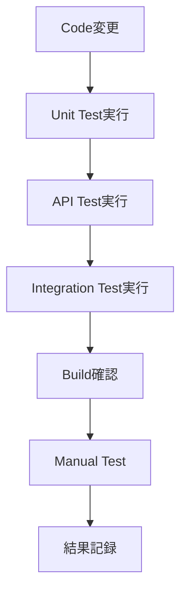
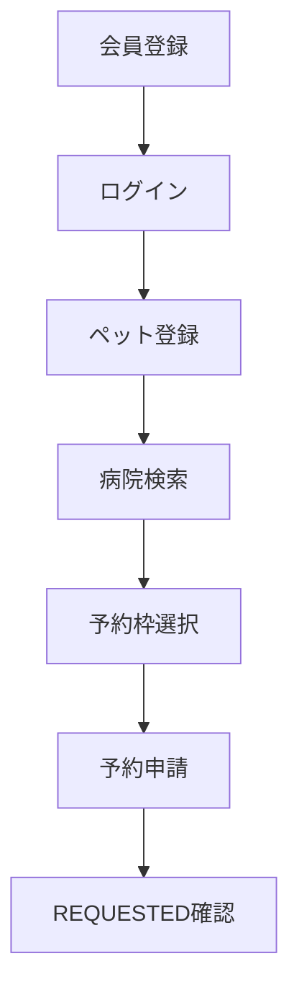
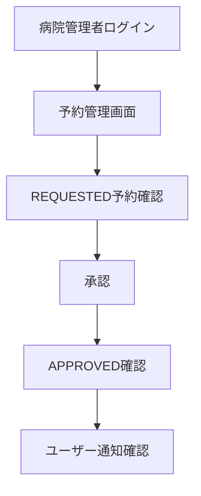
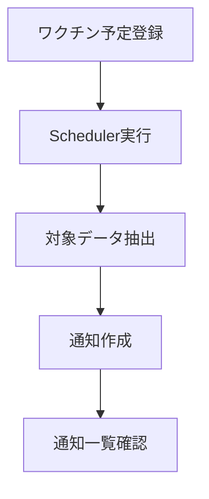

# 11_Test_Strategy

# **テスト戦略書**

## **ドキュメント情報**

| **項目** | **内容** |
| --- | --- |
| Project | 大ペット（だいペット） |
| Document | Test Strategy |
| Author | Koh Hanyeong |
| Status | Draft |
| Updated | 2026-08-23 |

---

# **1. テスト戦略概要**

本ドキュメントでは、「大ペット」におけるテスト方針、テスト対象、テスト観点、テスト環境、テスト実施範囲を定義する。

本システムでは、認証、予約、状態遷移、権限制御、通知、分析APIを中心にテストを実施する。

特に以下を重点確認対象とする。

- 認証・認可の正常性
- Role別アクセス制御
- 予約状態遷移の整合性
- 重複予約防止
- Scheduler通知処理
- API Response形式
- DB Migration整合性

---

# **2. テスト対象範囲**

| **対象** | **内容** |
| --- | --- |
| Frontend | 画面表示、入力Validation、API通信 |
| Spring Boot API | 認証、予約、ペット、通知、権限制御 |
| Django Analysis API | 健康記録分析、統計API |
| PostgreSQL | テーブル制約、Migration、Index |
| Docker Compose | Container間通信、環境起動 |
| Scheduler | ワクチン通知処理 |

---

# **3. テスト種別**

| **テスト種別** | **目的** | **対象** |
| --- | --- | --- |
| Unit Test | 単一処理の検証 | Service / Utility |
| Repository Test | DBアクセス検証 | Repository / Query |
| API Test | Request / Response検証 | Controller / Endpoint |
| Integration Test | 複数コンポーネント連携検証 | Spring Boot / DB |
| E2E Test | 画面から業務完了まで確認 | Frontend + Backend |
| Security Test | 認証・認可検証 | JWT / Role |
| Migration Test | DB変更検証 | Flyway |
| Scheduler Test | 定期処理検証 | Vaccine Notification |

---

# **4. テスト環境**

## **4-1. Local Test Environment**

| **項目** | **内容** |
| --- | --- |
| Frontend | React 18.3.1 |
| Node.js | 24.17.0 |
| Spring Boot | 3.3.13 |
| Java | 17 |
| Python | 3.12.10 |
| Django REST Framework | 3.15.2 |
| PostgreSQL | 16.9 |
| Container | Docker Compose v2 |

---

## **4-2. Test Database**

| **項目** | **内容** |
| --- | --- |
| Unit Test | DB不使用（Repository を Mockito でモック） |
| Integration Test | 未導入（導入時は PostgreSQL Testcontainers を想定） |
| Local Manual Test | Docker PostgreSQL |

> **注記:** Repository をモックする単体テストでは null 許容パラメータの `@Query` 不具合を検出できない（`12_Trouble_Shooting` §3-10 の実例参照）。null 許容パラメータを含む `@Query` には実DB接続の統合テスト追加が望ましい。

---

# **5. テスト実行フロー**



---

# **6. テスト観点**

# **6-1. 認証テスト**

| **Test ID** | **観点** | **期待結果** |
| --- | --- | --- |
| AUTH-T001 | 正常ログイン | Access Token / Refresh Token発行 |
| AUTH-T002 | パスワード不一致 | AUTH-001返却 |
| AUTH-T003 | 存在しないユーザー | AUTH-001返却 |
| AUTH-T004 | 停止ユーザー | AUTH-002返却 |
| AUTH-T005 | Refresh Token再発行 | 新Access Token発行 |
| AUTH-T006 | 失効Refresh Token利用 | AUTH-003返却 |
| AUTH-T007 | ログアウト | Refresh Token revoked=true |

---

# **6-2. Role認可テスト**

| **Test ID** | **Role** | **操作** | **期待結果** |
| --- | --- | --- | --- |
| ROLE-T001 | ROLE_USER | ペット登録 | 成功 |
| ROLE-T002 | ROLE_USER | 予約承認 | 403 |
| ROLE-T003 | ROLE_HOSPITAL_ADMIN | 予約承認 | 成功 |
| ROLE-T004 | ROLE_HOSPITAL_ADMIN | 病院管理 | 403 |
| ROLE-T005 | ROLE_SYSTEM_ADMIN | 病院管理 | 成功 |
| ROLE-T006 | 未認証 | 認証必須API | 401 |

---

# **6-3. ペット管理テスト**

| **Test ID** | **観点** | **期待結果** |
| --- | --- | --- |
| PET-T001 | ペット登録 | 登録成功 |
| PET-T002 | ペット名未入力 | Validation Error |
| PET-T003 | 他ユーザーのペット詳細取得 | 403 |
| PET-T004 | ペット更新 | 更新成功 |
| PET-T005 | ペット削除 | deleted_at設定 |

---

# **6-4. 健康記録テスト**

| **Test ID** | **観点** | **期待結果** |
| --- | --- | --- |
| HEALTH-T001 | 健康記録登録 | 登録成功 |
| HEALTH-T002 | 他ユーザーのペットに記録登録 | 403 |
| HEALTH-T003 | 体重に負数入力 | Validation Error |
| HEALTH-T004 | 健康記録一覧取得 | 登録済データ取得 |
| HEALTH-T005 | 健康記録削除 | deleted_at設定 |

---

# **6-5. 病院・予約枠テスト**

| **Test ID** | **観点** | **期待結果** |
| --- | --- | --- |
| HOSP-T001 | 病院一覧取得 | ACTIVE病院のみ取得 |
| HOSP-T002 | 停止病院への予約 | RESERVATION-002 |
| SCH-T001 | AVAILABLE予約枠取得 | 取得成功 |
| SCH-T002 | BLOCKED予約枠予約 | RESERVATION-003 |
| SCH-T003 | 過去予約枠予約 | RESERVATION-005 |

---

# **6-6. 予約テスト**

| **Test ID** | **観点** | **期待結果** |
| --- | --- | --- |
| RSV-T001 | 正常予約申請 | REQUESTED作成 |
| RSV-T002 | 同一schedule_id重複予約 | RESERVATION-001 |
| RSV-T003 | 他人ペット予約 | RESERVATION-004 |
| RSV-T004 | 予約キャンセル | CANCELLED更新 |
| RSV-T005 | COMPLETED予約キャンセル | 状態遷移エラー |
| RSV-T006 | 予約詳細取得 | 正常取得 |

---

# **6-7. 予約状態遷移テスト**

| **Test ID** | **現在状態** | **操作** | **期待状態** |
| --- | --- | --- | --- |
| STATE-T001 | REQUESTED | 承認 | APPROVED |
| STATE-T002 | REQUESTED | 却下 | REJECTED |
| STATE-T003 | REQUESTED | キャンセル | CANCELLED |
| STATE-T004 | APPROVED | 診療完了 | COMPLETED |
| STATE-T005 | APPROVED | キャンセル | CANCELLED |
| STATE-T006 | COMPLETED | 承認 | 不正遷移エラー |
| STATE-T007 | REJECTED | 承認 | 不正遷移エラー |
| STATE-T008 | CANCELLED | 承認 | 不正遷移エラー |

---

# **6-8. 通知テスト**

| **Test ID** | **観点** | **期待結果** |
| --- | --- | --- |
| NOTI-T001 | 予約承認通知 | RESERVATION_APPROVED作成 |
| NOTI-T002 | 予約却下通知 | RESERVATION_REJECTED作成 |
| NOTI-T003 | 診療完了通知 | TREATMENT_COMPLETED作成 |
| NOTI-T004 | 通知一覧取得 | ユーザー別通知取得 |
| NOTI-T005 | 通知既読処理 | is_read=true |

---

# **6-9. Schedulerテスト**

| **Test ID** | **観点** | **期待結果** |
| --- | --- | --- |
| SCHD-T001 | SCHEDULEDワクチン検索 | 対象抽出 |
| SCHD-T002 | 接種7日前通知 | VACCINATION通知作成 |
| SCHD-T003 | COMPLETEDワクチン | 通知対象外 |
| SCHD-T004 | CANCELLEDワクチン | 通知対象外 |
| SCHD-T005 | 通知重複防止 | 重複作成なし |

---

# **6-10. Django Analysis APIテスト**

| **Test ID** | **観点** | **期待結果** |
| --- | --- | --- |
| ANA-T001 | 健康分析取得 | weightTrend返却 |
| ANA-T002 | 症状統計取得 | symptomStatistics返却 |
| ANA-T003 | データなし | 空配列返却 |
| ANA-T004 | 他ユーザーのペット分析 | 403 |

---

# **7. API Response確認**

## **Success Response**

```json
{
  "success": true,
  "data": {}
}
```

---

## **Error Response**

```json
{
  "success": false,
  "code": "RESERVATION-001",
  "message": "既に予約済みです。"
}
```

---

# **8. Migration Test**

## **8-1. 確認対象**

| **項目** | **内容** |
| --- | --- |
| Table作成 | 06_ERD通り作成されること |
| FK制約 | 正常に作成されること |
| Index | 検索対象Indexが作成されること |
| Default | Status初期値が設定されること |

---

## **8-2. Migration確認コマンド**

```json
./gradlew flywayMigrate
```

---

## **8-3. Build確認**

```json
./gradlew clean build
```

---

# **9. Frontend Test観点**

| **Test ID** | **観点** | **期待結果** |
| --- | --- | --- |
| FE-T001 | ログイン画面表示 | 表示成功 |
| FE-T002 | 入力Validation | エラー表示 |
| FE-T003 | API通信成功 | 画面更新 |
| FE-T004 | API Error | エラーメッセージ表示 |
| FE-T005 | Role別画面制御 | 不要メニュー非表示 |

---

# **10. E2E Test Scenario**

# **10-1. ユーザー予約シナリオ**



---

# **10-2. 病院管理者承認シナリオ**



---

# **10-3. ワクチン通知シナリオ**



---

# **11. Test Data方針**

| **データ** | **内容** |
| --- | --- |
| USER | 一般ユーザー |
| HOSPITAL_ADMIN | 病院管理者 |
| SYSTEM_ADMIN | システム管理者 |
| PET | テスト用ペット |
| HOSPITAL | ACTIVE / SUSPENDED病院 |
| SCHEDULE | AVAILABLE / BLOCKED予約枠 |
| RESERVATION | REQUESTED / APPROVED / COMPLETED |

---

# **12. テスト結果記録方針**

| **項目** | **内容** |
| --- | --- |
| Test ID | テスト識別子 |
| 実施日 | 実施日 |
| 実施者 | 実施者 |
| 結果 | PASS / FAIL |
| Evidence | Screenshot / API Response |
| 備考 | 補足 |

---

# **13. 不具合管理方針**

| **項目** | **内容** |
| --- | --- |
| Bug ID | 不具合識別子 |
| Priority | High / Middle / Low |
| Status | Open / Fixed / Closed |
| Cause | 原因 |
| Fix | 対応内容 |

---

# **14. テスト完了条件**

以下条件を満たした場合、テスト完了とする。

- 主要API正常系が全てPASS
- 認証・認可テストがPASS
- 予約状態遷移テストがPASS
- Migration確認がPASS
- Critical / High不具合が0件
- API Response形式が統一されていること

---

# **15. 関連ドキュメント**

| **ドキュメント** | **内容** |
| --- | --- |
| [02_Requirement_Definition](02_Requirement_Definition%20362d097bd4f78009a0c8caf70e4df7e0.md)  | 要件定義 |
| [03_Business_Flow](03_Business_Flow%20362d097bd4f7808f8af1ff288a84b306.md)  | 業務フロー |
| [06_ERD](06_ERD%20363d097bd4f780699f2cd5859607c3c8.md)  | DB設計 |
| [07_API_Design](07_API_Design%20363d097bd4f78052a200e297abde89f3.md)  | API設計 |
| [08_State_Design](08_State_Design%20365d097bd4f7808f9b01de0aa34fa730.md)  | 状態設計 |
| [09_Security_Design](09_Security_Design%20366d097bd4f78074af53e3854d02bdc6.md)  | セキュリティ設計 |
| [10_Development_Environment](10_Development_Environment%20366d097bd4f78035ba4aef5e47b56378.md)  | 開発環境 |

---