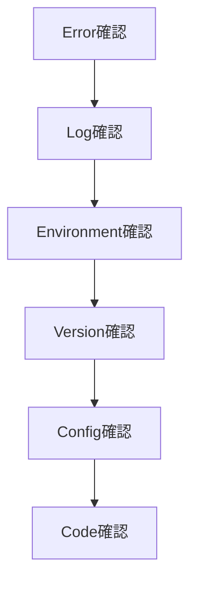

# 12_Trouble_Shooting

# **トラブルシューティング集**

## **ドキュメント情報**

| **項目** | **内容** |
| --- | --- |
| Project | 大ペット（だいペット） |
| Document | Trouble Shooting |
| Author | Koh Hanyeong |
| Status | Draft |
| Updated | 2026-05-17 |

---

# **1. ドキュメント概要**

本ドキュメントでは、「大ペット」開発中に発生する可能性がある代表的な問題、およびその原因・対応方法を整理する。

対象範囲:

- Frontend
- Spring Boot
- Django REST Framework
- PostgreSQL
- Docker Compose
- JWT認証
- Flyway Migration
- CORS
- Scheduler
- Build環境

---

# **2. Frontend関連**

# **2-1. npm install失敗**

## **症状**

```bash
npm install
```

実行時に dependency resolve error が発生する。

---

## **原因**

- Node.js Version不一致
- package-lock.json不整合
- 古いnode_modules残存

---

## **対応方法**

```bash
rm -rf node_modules
rm package-lock.json

npm install
```

---

## **確認ポイント**

```bash
node -v
npm -v
```

---

## **推奨Version**

| **項目** | **Version** |
| --- | --- |
| Node.js | 20.20.2 LTS |
| npm | 10.8.2 |

---

# **2-2. Vite起動失敗**

## **症状**

```bash
npm run dev
```

実行時にPort Error発生。

---

## **原因**

5173 Port使用中。

---

## **対応方法**

使用中Port確認:

```bash
# Windows
netstat -ano | findstr 5173

# Mac
lsof -i :5173
```

Process終了:

```bash
#Windows
taskkill /f /pid PID

# Mac
kill -9 PID
```

---

# **2-3. API通信失敗（Frontend）**

## **症状**

Axios通信時にNetwork Error発生。

---

## **原因**

- Backend未起動
- CORS設定不備
- API URL誤設定

---

## **対応方法**

```
VITE_API_URL=http://localhost:8080
```

確認。

---

# **2-4. Tailwind CSS適用されない**

## **原因**

- tailwind.config.js設定漏れ
- content path不一致

---

## **対応方法**

```jsx
content: [
  "./index.html",
  "./src/**/*.{js,ts,jsx,tsx}"
]
```

---

# **3. Spring Boot関連**

# **3-1. Gradle Build失敗**

## **症状**

```bash
./gradlew clean build
```

失敗。

---

## **原因**

- Java Version不一致
- Dependency Version競合
- springdoc互換性問題

---

## **対応方法**

```bash
java -version
```

確認。

---

## **推奨Version**

| **項目** | **Version** |
| --- | --- |
| Java | 17 |
| Spring Boot | 3.3.13 |
| Gradle | 8.14.4 |

---

# **3-2. springdoc起動エラー**

## **症状**

```
NoClassDefFoundError
```

---

## **原因**

Spring Boot Versionとspringdoc Version不一致。

---

## **対応方法**

```groovy
// build.gradle
implementation 'org.springdoc:springdoc-openapi-starter-webmvc-ui:2.6.0'
```

利用。

---

# **3-3. ApplicationContext起動失敗**

## **症状**

```
Failed to load ApplicationContext
```

---

## **原因**

- Bean循環参照
- DB接続失敗
- Security Config誤設定

---

## **対応方法**

以下確認:

- application.yml
- JWT Secret
- DB接続情報
- SecurityConfig

---

# **3-4. H2 Test DBエラー**

## **症状**

```
DataSourceBeanCreationException
```

---

## **原因**

Test DB設定なし。

---

## **対応方法**

```yaml
spring:
  datasource:
    url: jdbc:h2:mem:testdb
```

---

## **Test Profile**

```java
// src/test/java/koh/portfolio/authservice/AuthServiceApplicationTests.java
@ActiveProfiles("test")
```

追加。

---

# **3-5. ActiveProfilesエラー**

## **症状**

```
シンボルを見つけられません
```

---

## **原因**

Import漏れ。

---

## **対応方法**

```java
// src/test/java/koh/portfolio/authservice/AuthServiceApplicationTests.java
import org.springframework.test.context.ActiveProfiles;
```

追加。

---

# **3-6. JWT認証失敗**

## **症状**

401 Unauthorized

---

## **原因**

- Token期限切れ
- Authorization Header不備
- Secret不一致

---

## **Header形式**

```
Authorization: Bearer access-token
```

---

## **JWT Secret確認**

```
JWT_SECRET=change-this-secret
```

---

# **3-7. CORS Error**

## **症状**

```
Blocked by CORS policy
```

---

## **原因**

許可Origin未設定。

---

## **対応方法**

```java
allowedOrigins(
  "http://localhost:5173"
)
```

設定。

---

# **3-8. Flyway Migration失敗**

## **症状**

```
Validate failed
```

---

## **原因**

- SQL変更履歴不一致
- Migration修正
- checksum不一致

---

## **対応方法**

開発環境のみ:

```bash
./gradlew flywayRepair
```

---

## **注意事項**

既存Migration直接修正禁止。

---

# **3-9. Port競合**

## **症状**

```
Port 8080 already in use
```

---

## **確認方法**

```bash
# Windows
netstat -ano | findstr 5173

# Mac
lsof -i :5173
```

---

## **Process終了**

```bash
#Windows
taskkill /f /pid PID

# Mac
kill -9 PID
```

---

# **3-10. `function lower(bytea) does not exist`**

## **症状**

`@Query`でnull許容の検索パラメータを`(:param IS NULL OR LOWER(...) LIKE ...)`パターンで使うJPQLが、パラメータが実際に`null`の場合にのみ500エラーになる。

```
ERROR: function lower(bytea) does not exist
```

`GET /api/v1/hospitals`（keyword・area省略時）で発見（2026-08-09）。単体テストはRepositoryをモックしているため検出できず、実際にDBへ接続するまで気づけなかった。

---

## **原因**

Hibernate 6がnull値のバインドパラメータの型を推論できず、PostgreSQL JDBCドライバがデフォルトの`bytea`型として送信してしまう。

---

## **対応方法**

該当パラメータをJPQLで明示的にキャストする。

```java
@Query("""
        SELECT h FROM HospitalEntity h
        WHERE (:keyword IS NULL OR LOWER(h.name) LIKE LOWER(CONCAT('%', CAST(:keyword AS string), '%')))
        """)
```

---

## **教訓**

Service層のモックテストだけでは検出できないため、null許容パラメータを含む`@Query`には最低限1件、実DBに接続する統合テスト（`@DataJpaTest`等）を追加することが望ましい。

---

# **4. Django関連**

# **4-1. Python Version不一致**

## **症状**

```
ModuleNotFoundError
```

---

## **原因**

pyenv Version不一致。

---

## **確認方法**

```bash
python --version
```

---

## **推奨Version**

```
Python 3.12.10
```

---

# **4-2. pyenv認識しない**

## **原因**

.zshrc設定未適用。

---

## **対応方法**

```bash
# Mac
source ~/.zshrc
```

---

# **4-3. Django Server起動失敗**

## **症状**

```bash
python manage.py runserver
```

失敗。

---

## **原因**

- venv未有効化
- package未install
- DB接続失敗

---

## **対応方法**

```bash
# Mac
source .venv/bin/activate

pip install -r requirements.txt
```

---

# **4-4. DRF Import Error**

## **症状**

```
No module named rest_framework
```

---

## **対応方法**

```bash
pip install djangorestframework
```

---

# **5. PostgreSQL関連**

# **5-1. DB接続失敗**

## **症状**

```
Connection refused
```

---

## **原因**

- PostgreSQL未起動
- Docker Container停止
- Port誤設定

---

## **対応方法**

```bash
docker ps
```

確認。

---

# **5-2. Password認証失敗**

## **症状**

```
password authentication failed
```

---

## **原因**

DB Username / Password不一致。

---

## **確認対象**

```
DB_USERNAME
DB_PASSWORD
```

---

# **5-3. Relation does not exist**

## **症状**

```
relation xxx does not exist
```

---

## **原因**

Migration未実行。

---

## **対応方法**

```bash
./gradlew flywayMigrate
```

---

# **6. Docker関連**

# **6-1. Docker Compose起動失敗**

## **症状**

```bash
docker compose up
```

失敗。

---

## **原因**

- Docker Desktop未起動
- Port競合
- YAML構文エラー

---

## **対応方法**

```bash
docker compose config
```

でYAML確認。

---

# **6-2. Container間通信失敗**

## **症状**

Backend → DB接続不可。

---

## **原因**

localhost利用。

---

## **対応方法**

Docker内部ではService名利用。

```
DB_HOST=postgres
```

---

# **6-3. Volume問題**

## **症状**

DB初期化される。

---

## **原因**

Volume未設定。

---

## **対応方法**

```yaml
volumes:
  postgres-data:
```

設定。

---

# **7. Security関連**

# **7-1. 403 Forbidden**

## **原因**

Role権限不足。

---

## **確認対象**

- JWT Role
- Spring Security
- API Authorization

---

# **7-2. CSRF Error**

## **原因**

CSRF設定競合。

---

## **対応方法**

JWT認証利用時:

```java
// securityConfig
csrf.disable()
```

---

# **7-3. Password Encode Error**

## **症状**

ログイン失敗。

---

## **原因**

BCrypt未適用。

---

## **対応方法**

```java
passwordEncoder.encode()
```

利用。

---

# **8. Scheduler関連**

# **8-1. Scheduler実行されない**

## **原因**

@EnableScheduling未設定。

---

## **対応方法**

```java
@EnableScheduling
```

追加。

---

# **8-2. 通知重複生成**

## **原因**

既存通知確認なし。

---

## **対応方法**

通知生成前に存在確認。

---

# **9. Git関連**

# **9-1. branch push失敗**

## **原因**

Remote同期不一致。

---

## **対応方法**

```bash
git pull origin develop
```

後再push。

---

# **9-2. LF / CRLF Warning**

## **原因**

OS改行コード差異。

---

## **対応方法**

```bash
git config --global core.autocrlf input
```

---

# **10. IntelliJ関連**

# **10-1. Gradle認識失敗**

## **原因**

Gradle Reload未実施。

---

## **対応方法**

```
Reload All Gradle Projects
```

実行。

---

# **10-2. Lombok認識しない**

## **原因**

Plugin未install。

---

## **対応方法**

- Lombok Plugin install
- Annotation Processing有効化

---

# **10-3. Java Version不一致**

## **原因**

Project SDK mismatch。

---

## **推奨設定**

| **項目** | **Version** |
| --- | --- |
| SDK | Java 17 |
| Gradle JVM | Java 17 |

---

# **11. VSCode関連**

# **11-1. Python Interpreter認識失敗**

## **原因**

venv未選択。

---

## **対応方法**

```
Python: Select Interpreter
```

から `.venv` 選択。

---

# **12. Logging確認方法**

# **12-1. Spring Boot Log**

```bash
tail -f logs/application.log
```

---

# **12-2. Docker Log**

```bash
docker logs container-name
```

---

# **12-3. PostgreSQL Log**

```bash
docker logs postgres
```

---

# **13. Build確認コマンド**

# **13-1. Spring Boot**

```bash
./gradlew clean build
```

---

# **13-2. Frontend**

```bash
npm run build
```

---

# **13-3. Django**

```bash
python manage.py check
```

---

# **14. 障害調査優先順位**



---

# **15. 設計上注意事項**

## **Migration直接修正禁止**

適用済Migrationは直接修正しない。

---

## **Version整合性維持**

Spring Boot / springdoc / Java Version整合性を維持する。

---

## **Docker内部通信**

Container内部ではlocalhostを利用しない。

---

## **Security設定確認**

JWT / Role / CORS設定を優先確認する。

---

# **16. 関連ドキュメント**

| **ドキュメント** | **内容** |
| --- | --- |
| [09_Security_Design](09_Security_Design%20366d097bd4f78074af53e3854d02bdc6.md)  | セキュリティ設計 |
| [10_Development_Environment](10_Development_Environment%20366d097bd4f78035ba4aef5e47b56378.md)  | 開発環境 |
| [11_Test_Strategy](11_Test_Strategy%20366d097bd4f7806abc43d3ba52e7a24d.md)  | テスト戦略 |
| [07_API_Design](07_API_Design%20363d097bd4f78052a200e297abde89f3.md)  | API設計 |
| [08_State_Design](08_State_Design%20365d097bd4f7808f9b01de0aa34fa730.md)  | 状態設計 |

---