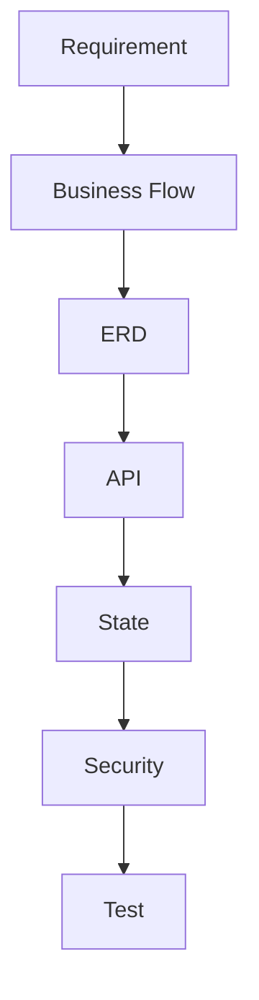

# 13_Retrospective

# **振り返り（Retrospective）**

## **ドキュメント情報**

| **項目** | **内容** |
| --- | --- |
| Project | 大ペット（だいペット） |
| Document | Retrospective |
| Author | Koh Hanyeong |
| Status | Draft |
| Updated | 2026-05-17 |

---

# **1. ドキュメント概要**

本ドキュメントでは、「大ペット」開発プロジェクトにおける設計・実装・テスト・環境構築を通じて得られた知見、課題、改善点を整理する。

本プロジェクトは単純なCRUD開発ではなく、以下を意識して構築した。

- 実務レベル設計
- MSAを意識したBackend責務分離
- 状態遷移管理
- Role Based Authorization
- JWT認証
- Docker統合環境
- 文書主導開発
- 保守性・拡張性重視設計

---

# **2. プロジェクト目的**

## **2-1. 開発目的**

本プロジェクトは以下を目的として開発した。

| **目的** | **内容** |
| --- | --- |
| Backend技術力証明 | Spring Boot / Django REST Framework |
| 設計力証明 | ERD / API / Security / State設計 |
| 実務力証明 | Docker / Migration / JWT |
| 保守性意識 | Change Management |
| 上流工程対応 | 要件定義〜設計書作成 |

---

## **2-2. なぜ「大ペット」を選択したか**

業務システムに近い以下特徴を持たせるため。

- Role管理
- 予約業務
- 状態遷移
- 通知Scheduler
- 権限制御
- 統計分析
- API連携

単純掲示板では説明できない業務設計を表現することを目的とした。

---

# **3. 良かった点**

# **3-1. 文書主導開発**

## **内容**

開発前に以下設計を先行実施した。

- Requirement Definition
- Business Flow
- System Architecture
- ERD
- API Design
- State Design
- Security Design
- Test Strategy

---

## **効果**

| **効果** | **内容** |
| --- | --- |
| 実装迷い減少 | API責務明確化 |
| 状態整合性向上 | State Design先行 |
| DB修正減少 | ERD先行 |
| API統一 | Response形式統一 |

---

# **3-2. 状態設計先行**

## **内容**

予約状態遷移を実装前に定義した。

```
REQUESTED
APPROVED
REJECTED
COMPLETED
CANCELLED
```

---

## **効果**

- 不正状態遷移防止
- Scheduler整合性向上
- Notification連携容易化

---

# **3-3. JWT + Refresh Token構成**

## **内容**

JWTのみではなく、Refresh Token DB管理を導入した。

---

## **効果**

| **項目** | **効果** |
| --- | --- |
| 強制ログアウト | 可能 |
| Token失効 | 可能 |
| Security向上 | JWT漏洩対策 |

---

# **3-4. Backend責務分離**

## **内容**

Spring BootとDjangoを役割分離した。

| **Backend** | **役割** |
| --- | --- |
| Spring Boot | 業務API |
| Django | 分析API |

---

## **効果**

- 責務明確化
- 将来拡張容易
- 分析ロジック分離

---

# **3-5. Docker統合環境**

## **内容**

Docker Composeで統合開発環境を構築した。

---

## **効果**

| **項目** | **内容** |
| --- | --- |
| 環境差異削減 | ローカル統一 |
| Onboarding容易化 | 起動統一 |
| DB構築簡略化 | PostgreSQL Container |

---

# **4. 苦労した点**

# **4-1. Spring Boot Version互換性**

## **問題**

Spring Boot Version変更時、springdoc Version不一致が発生。

---

## **発生事象**

```
NoClassDefFoundError
```

---

## **原因**

Spring Bootとspringdocの互換性不一致。

---

## **学習内容**

Version整合性管理の重要性を理解した。

---

# **4-2. Test Environment構築**

## **問題**

H2 Test DB設定不足によりApplicationContext起動失敗。

---

## **発生事象**

```
DataSourceBeanCreationException
```

---

## **対応**

- application-test.yml追加
- @ActiveProfiles導入

---

## **学習内容**

Test環境分離の重要性を理解した。

---

# **4-3. CORS問題**

## **問題**

Frontend → Backend通信時にCORS Error発生。

---

## **学習内容**

Origin制御とSecurity設定理解が深まった。

---

# **4-4. JWT認証構成**

## **問題**

Access Token / Refresh Token責務整理が複雑。

---

## **学習内容**

| **項目** | **内容** |
| --- | --- |
| Access Token | 短期認証 |
| Refresh Token | 再発行制御 |
| DB管理 | 強制失効対応 |

---

# **4-5. 状態遷移設計**

## **問題**

予約状態の不正遷移制御が複雑。

---

## **学習内容**

状態設計を後回しにすると保守性が低下することを理解した。

---

# **5. 改善したい点**

# **5-1. CI/CD導入**

## **現状**

手動Build中心。

---

## **改善予定**

| **項目** | **内容** |
| --- | --- |
| GitHub Actions | Build自動化 |
| Test Automation | 自動Test |
| Docker Build | Image Build |
| Deploy | 自動Deploy |

---

# **5-2. Monitoring追加**

## **現状**

Logging中心。

---

## **改善予定**

| **項目** | **内容** |
| --- | --- |
| Prometheus | Metrics |
| Grafana | Dashboard |
| ELK | Central Logging |

---

# **5-3. Cache導入**

## **現状**

DB直接アクセス中心。

---

## **改善予定**

```
Redis
```

導入検討。

---

# **5-4. MSA深化**

## **現状**

論理分離中心。

---

## **改善予定**

- API Gateway
- Message Queue
- Event Driven

導入検討。

---

# **6. 実務観点で意識した点**

# **6-1. 文書整合性**

以下整合性を維持した。



---

# **6-2. Change Management**

Version、ERD、API、State変更時に関連文書修正を前提とした。

---

# **6-3. 保守性重視**

| **項目** | **内容** |
| --- | --- |
| Layer分離 | Hexagonal-like（UseCase / Domain / Port / Adapter） |
| 状態管理 | Domain・Service集中 |
| Exception Handling | Global統一 |
| Migration管理 | Flyway統一 |

---

# **6-4. Security意識**

以下を設計段階から考慮した。

- JWT
- Role Authorization
- CORS
- Validation
- Password Hash
- Refresh Token
- HTTPS

---

# **7. 今後挑戦したい内容**

| **項目** | **内容** |
| --- | --- |
| Kubernetes | Container Orchestration |
| AWS/GCP | Cloud Infrastructure |
| Redis | Cache |
| Kafka | Event Streaming |
| CI/CD | 自動Deploy |
| Monitoring | Observability |

---

# **8. 技術的に成長した点**

# **8-1. Backend設計**

- REST API設計
- State設計
- Security設計
- Role設計

理解が深まった。

---

# **8-2. Database設計**

- FK設計
- Index設計
- 論理削除
- Migration管理

理解が向上した。

---

# **8-3. Infrastructure理解**

- Docker Compose
- Container通信
- Environment Variable
- Build環境

理解が向上した。

---

# **8-4. 文書化能力**

Notionを利用した実務レベル設計書整理経験を得た。

---

# **9. 開発を通じて得た考え**

## **実装より設計が重要**

実装速度より、設計整合性の方が長期保守性に大きく影響することを理解した。

---

## **状態管理の重要性**

業務システムでは状態遷移が中心になることを理解した。

---

## **文書の重要性**

文書がない場合、実装と仕様が乖離しやすいことを理解した。

---

## **Security後付けの危険性**

認証・認可・Role設計は初期段階で考慮すべきと理解した。

---

# **10. プロジェクト総括**

「大ペット」を通じて、単純機能実装ではなく、実務を意識した以下経験を得ることができた。

- 上流工程設計
- REST API設計
- 状態設計
- Security設計
- Test Strategy設計
- Docker統合環境構築
- Backend責務分離
- 文書主導開発

また、実装だけではなく、変更管理・保守性・整合性維持の重要性を強く理解できた。

---

# **11. 関連ドキュメント**

| **ドキュメント** | **内容** |
| --- | --- |
| [02_Requirement_Definition](02_Requirement_Definition%20362d097bd4f78009a0c8caf70e4df7e0.md)  | 要件定義 |
| [03_Business_Flow](03_Business_Flow%20362d097bd4f7808f8af1ff288a84b306.md)  | 業務フロー |
| [04_System_Architecture](04_System_Architecture%20362d097bd4f780b6b4d2c28d4ae357a1.md)  | システム構成 |
| [06_ERD](06_ERD%20363d097bd4f780699f2cd5859607c3c8.md)  | DB設計 |
| [07_API_Design](07_API_Design%20363d097bd4f78052a200e297abde89f3.md)  | API設計 |
| [08_State_Design](08_State_Design%20365d097bd4f7808f9b01de0aa34fa730.md)  | 状態設計 |
| [09_Security_Design](09_Security_Design%20366d097bd4f78074af53e3854d02bdc6.md)  | セキュリティ設計 |
| [10_Development_Environment](10_Development_Environment%20366d097bd4f78035ba4aef5e47b56378.md)  | 開発環境 |
| [11_Test_Strategy](11_Test_Strategy%20366d097bd4f7806abc43d3ba52e7a24d.md)  | テスト戦略 |

---